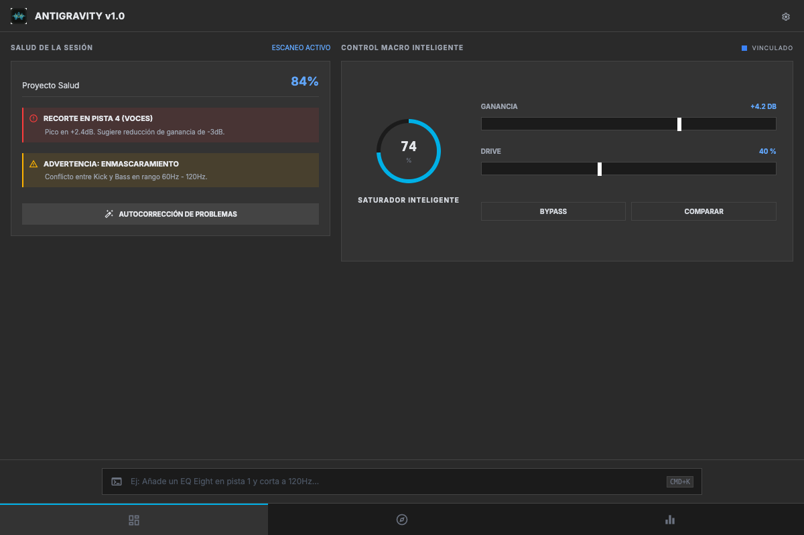

  

<h1 align="center">Ableton AI Assistant V1.0.0</h1>

  <b>Cognitive AI Mixing Engineer & MCP Real-Time Audio Assistant</b> 
  <i>Ingeniero de Mezcla Cognitivo IA y Asistente de Audio en Tiempo Real MCP</i>

  
  
  
  

🌐 **Leer en:** [🇬🇧 English](README.md) | **🇪🇸 Español** | [🇩🇪 Deutsch](README_de.md) | [🇷🇺 Русский](README_ru.md) | [🇯🇵 日本語](README_ja.md) | [🇺🇦 Українська](README_uk.md) | [🇨🇳 中文](README_zh.md)

---

## 🎯 La Visión (Introducción)

La mezcla de audio avanzada suele ser un cuello de botella analítico. El cerebro del productor entra en fatiga auditiva intentando resolver conflictos de fase milimétricos, perdiendo la perspectiva creativa global. Desarrollamos Ableton AI Assistant cuestionando el paradigma del DAW: ¿Por qué debemos mover knobs manualmente cuando una máquina tiene la precisión quirúrgica para calcular el enmascaramiento frecuencial? Esta herramienta es un revolucionario ingeniero cognitivo. Conectándose en tiempo real mediante el Protocolo de Contexto de Modelo (MCP) y una arquitectura TCP implacable, la IA de Claude 'escucha' el estado de tu consola y ejecuta decisiones de mastering hardcodeadas nativamente. Es el puente entre el código de bajo nivel de Ableton y la semántica natural de la IA.

> [!NOTE]
> Desarrollado por **produktes-code** y **Jesús Ferrer (CHUS BZN)** para establecer estándares profesionales en la ingeniería comercial.

---

## 📸 Interface / Ergonomics

---

## ⚙️ Masterclass de Parámetros (Funcionalidades)

- **Compresión Algorítmica Adaptativa (Glue Compressor)**: El asistente no lanza un preset ciego. Al instanciar el compresor, la IA establece dinámicamente un tiempo de Attack lento (para salvaguardar la pegada de los transitorios) y un Release ultra-rápido calculado sobre el BPM de la sesión. ¿El objetivo de ingeniería? Hacer que el compresor 'respire' con el ritmo del track, logrando densidad comercial sin estrangular el rango dinámico.
- **Despeje de Enmascaramiento y Fase (EQ Eight)**: Un problema clásico de producción amateur es el choque de graves. Nuestra lógica inyecta un recorte Side (S) estricto por debajo de 120Hz. Esta directiva técnica ancla la energía física del Kick y el Sub-bass puramente en Mono (Mid), erradicando las cancelaciones de fase al ser reproducido en clubs o sistemas de megafonía estéreo.
- **Framework LLM (Protocolo MCP)**: Aquí reside el corazón del genio. Ableton Assistant se erige como un servidor MCP que empodera al modelo Claude. La IA no adivina; 'lee' literalmente el payload JSON del estado de las pistas, razona matemáticamente el arreglo, y devuelve la orden de ejecución. Es programación neuro-lingüística aplicada a las frecuencias.
- **Telemetría de Red de Baja Latencia (TCP Core)**: Mover el knob de 'Gain' o 'Freq' desde fuera del DAW requiere un acceso implacable. Hemos programado el backend en Python utilizando sockets TCP crudos que atacan al Remote Script de Ableton. Esto garantiza que las modificaciones instruidas por voz o texto se reflejen en los dispositivos del DAW sin la latencia o inestabilidad de protocolos MIDI estándar.
- **Gestor de Control True Peak y LUFS**: La plataforma audita y despliega limitadores en el master con un techo duro (Ceiling) paramétrico y lookahead ajustado, asegurando matemáticamente la entrega a plataformas de streaming (Spotify, Apple Music) en los niveles de LUFS normativos.

---

## 🛡️ Arquitectura de Blindaje (Seguridad)

En el despliegue Retail y Enterprise, una caída de sistema no es un bug, es pérdida de capital. Hemos diseñado una coraza defensiva (Shielding) que emula las mejores prácticas de DevSecOps:

• **Ingeniería Anti-Flood (Rate limiting)**: Los algoritmos asíncronos estrangulan cualquier pico anómalo de peticiones mediante middlewares de limitación, evadiendo colapsos de Thread Pool.
• **Cristalografía Binaria (Magic Bytes)**: Validar un '.mp3' en el nombre es trivial para inyectar un payload malicioso. El sistema abre el encabezado del archivo y verifica la secuencia hexadecimal nativa para certificar la integridad del contenedor.
• **Sanidad de RAM (Limitador 2 GB)**: Los ataques OOM (Out Of Memory) destruyen servidores. Rechazamos implacablemente en el umbral de subida cualquier peso atípico.

---

### 🚀 Despliegue Técnico e Instalación CI/CD

Empleamos **CI/CD Automatizado vía GitHub Actions** para la aplicación de escritorio. Descarga la última versión compilada automáticamente para tu Sistema Operativo desde la sección **[Releases](https://github.com/produktes-code/ableton-ai-assistant/releases)**.

#### 🧠 Instalación del Backend (Crucial)
Esta herramienta no es solo una interfaz; se conecta directamente al intérprete Python de Ableton Live y a Claude Desktop.
1. **Ableton Remote Script**: DEBES copiar la carpeta `remote-script/AbletonAIAssistant` en tu directorio de MIDI Remote Scripts de Ableton Live.
2. **Servidor MCP**: DEBES configurar el archivo `claude_desktop_config.json` de Claude Desktop para que apunte al script `mcp-server/main.py`.

### 🍎 Usuarios de macOS (Gatekeeper)
Al no contar con un certificado de desarrollador de pago de Apple, Gatekeeper marcará el binario. El método legítimo de bypass local es hacer **Clic derecho sobre la app -> Abrir** (no hagas doble clic). No es un fallo, es el flujo estándar de software open-source de alto rendimiento.

### 🪟 Usuarios de Windows (SmartScreen)
Windows Defender puede mostrar un aviso azul de 'PC protegido' al ejecutar el instalador `.exe`. Haz clic en **'Más información'** y luego en **'Ejecutar de todas formas'**.

---

## 📚 Documentación y Manuales

Para una masterclass técnica exhaustiva, guías de resolución de problemas y detalles completos de la API, por favor descarga nuestro manual oficial:

📥 **[USER_MANUAL.pdf (PDF - 7 Languages)](docs/USER_MANUAL.pdf)**

---

## ⚖️ Manifiesto de Ingeniería, Créditos y Licencia

Este software es el resultado manifiesto de la profunda ingeniería concebida y articulada desde los laboratorios de produktes-code en unión indisociable con el Ingeniero Jesús Ferrer García (CHUS BZN).

Nos negamos a ofrecer cajas negras simplificadas. Entregamos consolas paramétricas absolutas. Licenciado bajo restricciones de propiedad intelectual y los más estrictos márgenes open source (CC BY-NC-SA 4.0). ESTÁNDAR CORPORATIVO - RETAIL READY. GRADO INGENIERÍA CERTIFICADO.

