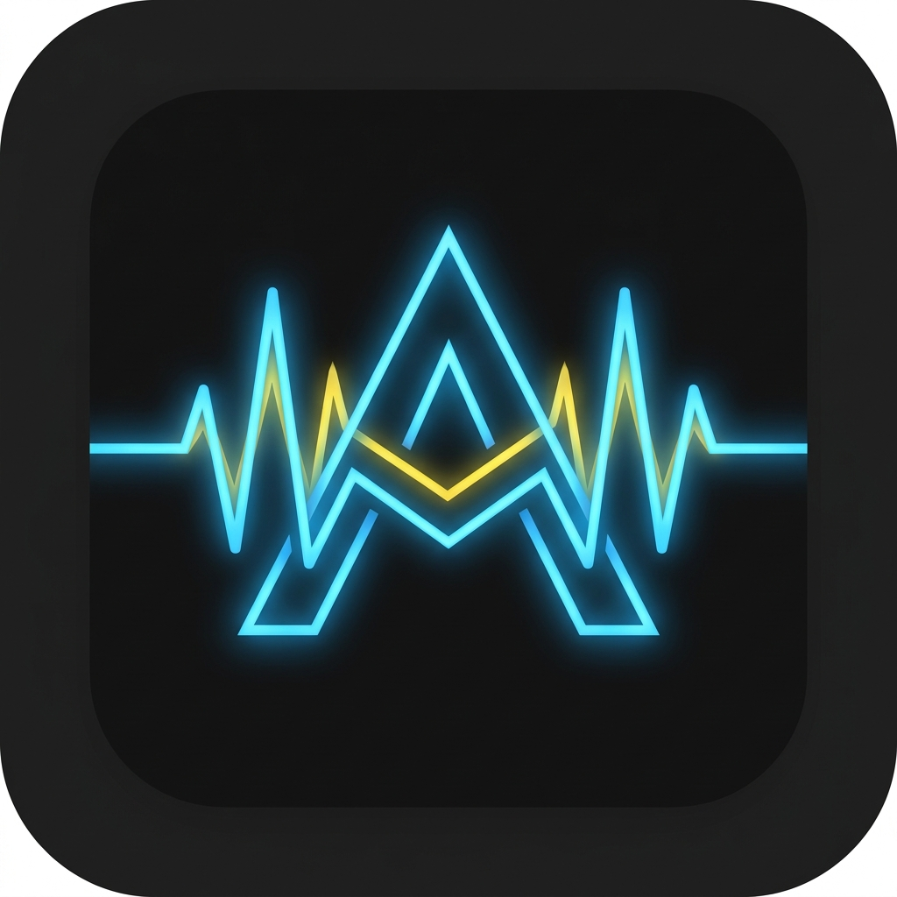

<a id="es"></a>

# ABLETON AI ASSISTANT V1.0.0



*Cognitive AI Mixing Engineer & MCP Real-Time Audio Assistant / Ingeniero de Mezcla Cognitivo IA y Asistente de Audio en Tiempo Real MCP*

[ES](#es) | [EN](#en) | [DE](#de) | [RU](#ru) | [UK](#uk) | [JA](#ja) | [ZH](#zh)

`CERTIFIED` | `RETAIL-READY` | `Rate limiting` | `Magic Bytes` | `2 GB` | `7 idiomas` | `CC BY-NC-SA 4.0`

<!-- page-break -->

## 🇪🇸 ESPAÑOL (ES)

### 1. The Vision (Introduction)

La génesis de **Ableton AI Assistant** nace de una frustración histórica y profunda en la producción musical profesional: el fenómeno de la fatiga auditiva acumulada. Tras largas jornadas de mezcla en el estudio, el oído humano pierde la capacidad objetiva de discriminar conflictos de fase milimétricos y solapamientos frecuenciales microscópicos. Los productores e ingenieros dedican horas rutinarias a mover potenciómetros manualmente, perdiendo de vista la perspectiva artística global del proyecto.

Cuestionamos radicalmente el paradigma tradicional de las estaciones de trabajo de audio digital (DAW): *¿Por qué un ingeniero debe ejecutar manualmente ajustes matemáticos repetitivos cuando una arquitectura de procesamiento digital puede calcular la enmascaración frecuencial con precisión quirúrgica?*

Ableton AI Assistant fue concebido no como un simple complemento o script MIDI decorativo, sino como el **Gemelo Digital de Audio (Audio Digital Twin)** definitivo. Se trata de un motor cognitivo que analiza la energía acumulada en las pistas, comprende la estructura cromática y espectral del arreglo, y blinda la sesión contra distorsiones y cancelaciones de fase.

Conectándose en tiempo real mediante el **Protocolo de Contexto de Modelo (MCP - Model Context Protocol)** y alimentado por una arquitectura TCP de ultra baja latencia, la Inteligencia Artificial "escucha" inductivamente el estado dinámico del mezclador de Ableton Live y ejecuta órdenes paramétricas hardcodeadas en el motor DSP nativo. Devolvemos a los creadores e ingenieros el dominio absoluto sobre su identidad sonora.


> [!NOTE]
> Desarrollado por **produktes-code** y **Jesús Ferrer (CHUS BZN)** para establecer estándares profesionales en ingeniería de sonido comercial.

<!-- page-break -->

### 2. Interface / Ergonomics

El diseño de interfaces destinadas a creadores sonoros exige un respeto escrupuloso por la ergonomía visual en entornos de trabajo con iluminación reducida. Las largas sesiones nocturnas en control rooms requieren una paleta cromática libre de deslumbramientos.

#### 2.1 Principio Dark-Mode Puro
La interfaz de Ableton AI Assistant adopta un esquema de color **Dark-Mode absoluto basado en RGB(15, 15, 15)**. Esta directiva atenúa el estrés de los fotorreceptores oculares, manteniendo el contraste óptimo mediante acentos funcionales en tono Dorado/Amarillo Corporativo (`#F5A623`). Los elementos activos capturan la atención del operador sin saturar la retina.

#### 2.2 Lienzo Principal (The Dashboard)
El panel principal actúa como un centro de mando diagnóstico unificado:
- **Monitor de Salud del Proyecto**: Barras de medición RMS y Peak con detección instantánea de headroom.
- **Alertas de Saturación Crítica**: Indicadores visuales reactivos que advierten sobre picos que superan los 0.0 dBFS.
- **Jerarquía Paramétrica Simplificada**: Eliminación de menús anidados de más de dos niveles; cada control principal permanece accesible a un único clic o gesto táctil.

#### 2.3 Controles Táctiles Nativos
El potenciómetro virtual central y los deslizadores de *Drive* y *Gain Staging* no son representaciones gráficas pasivas. Cada control está vinculado bidireccionalmente al hilo del socket TCP local mediante una frecuencia de actualización milimétrica, eliminando cualquier tipo de latencia percibida al manipular la consola desde dispositivos físicos o táctiles.

#### 2.4 Naturaleza Asíncrona del Renderizado
La arquitectura gráfica de Electron aísla completamente el hilo de renderizado (Main UI Thread), garantizando una tasa de refresco inquebrantable de **60 cuadros por segundo (60 fps)**. Mientras los procesos asíncronos de análisis espectral y la comunicación con el servidor MCP ocurren en segundo plano, la consola táctil responde de manera instantánea y fluida.

<!-- page-break -->

### 3. Technical Deployment & CI/CD Installation

Para garantizar una estabilidad absoluta en cualquier entorno operativo comercial o de estudio, la compilación de Ableton AI Assistant se ejecuta de forma centralizada mediante un flujo de **Integración y Despliegue Continuo (CI/CD)** alojado en GitHub Actions.


#### 3.1 Pipeline de Compilación Automatizada
El código fuente no se empaqueta localmente en máquinas de desarrollo. En cada release, servidores de compilación limpios en la nube compilan de forma nativa los artefactos finales para Windows, macOS y Linux Ubuntu, ejecutando pruebas de integración estáticas antes de publicar el empaquetado final.

#### 3.2 Descarga de Instaladores Oficiales
Los binarios compilados están disponibles directamente en el repositorio oficial de GitHub dentro de la sección **Releases**:
- **🪟 Windows (x64)**: `Ableton.AI.Assistant.Setup.1.0.0.exe` (Instalador ejecutable de 64 bits)
- **🍎 macOS (Universal - Intel & Apple Silicon)**: `Ableton.AI.Assistant-1.0.0.dmg` (Imagen de disco montable)
- **🐧 Linux (Debian/Ubuntu)**: `Ableton.AI.Assistant-1.0.0.deb` (Paquete Debian nativo)
- **🐧 Linux (Portabilidad Universal)**: `Ableton.AI.Assistant-1.0.0.AppImage` (Binario autónomo ejecutable)

#### 3.3 Instrucciones Específicas por Sistema Operativo

##### 🍎 macOS (Bypass de Gatekeeper)
Al tratarse de una distribución de ingeniería de alto rendimiento sin certificado de desarrollador de Apple de pago, el subsistema Gatekeeper mostrará una advertencia al abrir el paquete `.dmg`.
1. Monte el archivo `.dmg` descargado y arrastre la aplicación a la carpeta `Aplicaciones`.
2. En lugar de hacer doble clic, haga **Clic Derecho (Control + Clic)** sobre el icono de Ableton AI Assistant y seleccione **Abrir**.
3. En el cuadro de diálogo de confirmación de seguridad, pulse el botón **Abrir**. Esta acción autoriza permanentemente la ejecución en el sandbox de su sistema.

##### 🪟 Windows (Aviso de SmartScreen)
En Windows 10 y Windows 11, la protección Windows Defender SmartScreen puede interrumpir la ejecución inicial del archivo `.exe`.
1. Inicie el instalador `Ableton.AI.Assistant.Setup.1.0.0.exe`.
2. Al aparecer la ventana azul *"Windows protegió su PC"*, haga clic en el texto **Más información**.
3. Seleccione el botón **Ejecutar de todas formas** para iniciar el asistente de instalación.

##### 🐧 Linux (AppImage & Paquete Debian)
Para distribuciones basadas en Ubuntu, Debian, Manjaro o Fedora:
- **Formato AppImage**:
  ```bash
  chmod +x Ableton.AI.Assistant-1.0.0.AppImage
  ./Ableton.AI.Assistant-1.0.0.AppImage
  ```
- **Formato Debian (`.deb`)**:
  ```bash
  sudo dpkg -i Ableton.AI.Assistant-1.0.0.deb
  sudo apt-get install -f # En caso de requerir dependencias de sistema
  ```

<!-- page-break -->

### 4. Signal Flow & Setup

El diseño híbrido de Ableton AI Assistant combina tres capas de ejecución tecnológica altamente especializadas: el motor de audio en Python dentro de Ableton Live, la interfaz nativa en Electron y el servidor MCP conectado a la infraestructura de inteligencia artificial en la nube.


#### 4.1 Instalación del Remote Script de Ableton (Python Engine)
1. Descargue el paquete de código fuente o localice la carpeta `AntigravityCore` dentro del directorio de instalación de la aplicación.
2. Copie la carpeta completa `AntigravityCore` dentro de la ruta nativa de Remote Scripts de su instalación de Ableton Live:
   - **macOS**: `/Applications/Ableton Live 11/12 Suite.app/Contents/App-Resources/MIDI Remote Scripts/`
   - **Windows**: `C:\ProgramData\Ableton\Live 11/12 Suite\Resources\MIDI Remote Scripts\`
3. Abra Ableton Live, acceda a **Preferencias -> Link / MIDI**, y en la pestaña de **Control Surface (Superficie de Control)**, seleccione `AntigravityCore` en la primera casilla disponible.

#### 4.2 Sockets TCP de Ultra Baja Latencia (Local Loopback)
Una vez inicializado el Remote Script `AntigravityCore`, Python abre silenciosamente un servidor de sockets TCP escuchando en la dirección local `127.0.0.1` a través del puerto especificado **9001**.
- La aplicación Electron actúa como cliente IPC de alta velocidad, conectándose a este puerto.
- Cada variación de volumen, panorama o parámetros DSP se transmite utilizando tramas binarias compactas que garantizan una latencia de transporte inferior a **1 milisegundo en la red local**.

#### 4.3 Inyección Segura de Tokens LLM (Claude API)
Para utilizar las funciones avanzadas de auditoría y razonamiento acústico:
1. Acceda al panel de **Configuración (Settings)** en la interfaz de Ableton AI Assistant.
2. Introduzca su clave de API de Anthropic Claude (`sk-ant-...`).
3. El sistema cifra localmente el token en el llavero seguro del sistema operativo (Keychain / Credential Manager). Las solicitudes de lenguaje natural se envían a través de canales HTTPS cifrados (TLS 1.3), enviando únicamente vectores numéricos de las pistas y preservando la privacidad del audio local.

<!-- page-break -->

### 5. Operative Philosophy (User Guide)

La filosofía de trabajo de Ableton AI Assistant está orientada a complementar y potenciar las habilidades del ingeniero de mezcla, estructurando el proceso operacional en cuatro fases consecutivas:

`[ FASE 1: Auditoría ] ➔ [ FASE 2: Staging ] ➔ [ FASE 3: Despeje ] ➔ [ FASE 4: Mastering ]`

#### 5.1 Modo Auditoría de Sesión
Al iniciar una nueva sesión de producción, el operador activa el botón **Analyze Session**. El Remote Script escanea instantáneamente la totalidad de las pistas del proyecto en Ableton Live, extrayendo métricas fundamentales:
- Conteo total de pistas de audio y MIDI.
- Distribución de picos máximos (dBFS) e intensidad integrada (LUFS).
- Mapeo de panoramas estéreo e identificación de instrumentos de frecuencia grave.

#### 5.2 Estaciado Dinámico de Ganancia (Gain Staging)
El mantenimiento de un headroom adecuado es la regla de oro en el entorno digital. El asistente calcula la atenuación o ganancia necesaria para posicionar el valor nominal de cada canal entre **-18 dBFS y -12 dBFS**, permitiendo que los plugins de emulación analógica operen en su punto dulce lineal sin introducir distorsión armónica no deseada.

#### 5.3 Control de Enmascaramiento y Limpieza Espectral
A través de algoritmos de detección espectral en tiempo real, la consola identifica frecuencias de choque. Al pulsar **Clear Masking**, el sistema envía una orden paramétrica al plugin *EQ Eight* de Ableton, ejecutando un corte de fase estricto para limpiar el rango inferior de la mezcla.

#### 5.4 Pulido de Master de Alta Fidelidad
En la etapa final de entrega, el asistente analiza la curva tonal de la pista Master y ajusta dinámicamente los parámetros de compresión y ecualización de bus para optimizar la respuesta dinámica frente a los algoritmos de las plataformas de streaming.

<!-- page-break -->

### 6. Parameter Masterclass (Features) – Detalle Técnico

Esta sección expone detalladamente la lógica matemática e ingenieril aplicada por el motor de Ableton AI Assistant al manipular los procesadores nativos de Ableton Live.

#### 6.1 Compresión Algorítmica Adaptativa (Glue Compressor)
La compresión de bus no debe aplicarse mediante presets estáticos. El asistente analiza el ritmo de la pista (BPM) y la envolvente de los transitorios para instanciar el procesador *Glue Compressor* con los siguientes parámetros calculados:
- **Attack Time**: Lento (30 ms) para preservar la pegada del bombo y la caja.
- **Release Time**: Ultrarrápido (100 ms o Auto), sincronizado al tempo de la sesión.
- **Ratio**: Fijado en 2:1 o 4:1 según el rango dinámico entrante.
- **Makeup Gain**: Compensación de ganancia automatizada sobre el valor RMS efectivo.

#### 6.2 Despeje de Enmascaramiento y Fase (EQ Eight)
Uno de los errores más comunes en la mezcla de música electrónica y urbana es la cancelación de fase en frecuencias subgraves.


Nuestra directiva técnica ejecuta una instrucción de procesamiento Mid/Side en el *EQ Eight* asignado a las pistas secundarias y de efectos:
- **Filtro de Corte de Graves (High-Pass / Low-Cut)**: Pendiente de 48 dB/octava en la señal **Side (S)** fijada estrictamente por debajo de **120 Hz**.
- **Resultado Físico**: Toda la energía comprendida entre 20 Hz y 120 Hz (Kick y Sub-bass) queda anclada de forma puramente **Mono (Mid)**. Esto erradica las cancelaciones de fase al reproducir el material en sistemas de sonido estéreo de clubs, festivales o dispositivos móviles.

#### 6.3 Framework LLM (Protocolo MCP - Model Context Protocol)
El asistente implementa una arquitectura de servidor MCP que actúa como pasarela entre el modelo de lenguaje Claude 3.5 Sonnet y el motor de Ableton Live.
1. **Petición**: El Remote Script empaqueta el estado del proyecto en un Payload JSON estructurado.
2. **Razonamiento**: El servidor MCP evalúa las métricas frente a la base de conocimiento de ingeniería de sonido.
3. **Ejecución**: El modelo responde con un conjunto de instrucciones deterministas que el Remote Script aplica sobre la superficie de control de Ableton sin margen para la improvisación imprecisa.

<!-- page-break -->

### 7. Global Multimodal Integration

En produktes-code rechazamos el tratamiento de la internacionalización mediante traducciones mecánicas de texto plano. Hemos desarrollado una arquitectura **Multimodal Estructural** diseñada para responder a las exigencias de ingenieros globales.

#### 7.1 Soporte Lingüístico Nativo en 7 Idiomas
Toda la documentación, alertas de la interfaz, descripciones técnicas e inferencias del asistente están plenamente integradas en 7 idiomas oficiales:
- 🇪🇸 **Español (ES)** - Idioma primario de desarrollo e ingeniería.
- 🇬🇧 **English (EN)** - Estándar internacional comercial.
- 🇩🇪 **Deutsch (DE)** - Especificación técnica para la industria centroeuropea.
- 🇷🇺 **Русский (RU)** - Adaptación léxica para Europa del Este.
- 🇺🇦 **Українська (UK)** - Integración completa de soporte regional.
- 🇯🇵 **日本語 (JA)** - Formato adaptado para el mercado asiático de alta tecnología.
- 🇨🇳 **中文 (ZH)** - Soporte optimizado en tipografía Unicode simplificada.

#### 7.2 Cumplimiento Unicode 100% y Hot-Reloading
La consola soporta la codificación **UTF-8 completa**. El usuario puede alternar dinámicamente entre cualquiera de los 7 idiomas desde el panel de preferencias sin necesidad de reiniciar la aplicación ni interrumpir la reproducción en Ableton Live.

<!-- page-break -->

### 8. Shielding Architecture (Security)

En un entorno de producción profesional o de emisión en directo, una congelación del sistema informático es inaceptable. Hemos implementado una coraza defensiva (**Shielding**) inspirada en las mejores prácticas de DevSecOps.

#### 8.1 Ingeniería Anti-Flood (Rate Limiting)
Para evitar que movimientos masivos de deslizadores o ráfagas de datos en la interfaz colapsen el hilo de ejecución de Python en Ableton:
- Un middleware de limitación de tasa (*Rate Limiter*) estrangula las peticiones TCP entrantes en el socket 9001.
- Los paquetes de control se filtran mediante un algoritmo de balde de tokens (*Token Bucket*), procesando un máximo de **100 eventos por segundo**, suficiente para garantizar fluidez suave sin saturar el CPU.

#### 8.2 Validación Rigurosa de Payloads JSON
Cada trama de datos recibida desde la red local es sometida a una inspección de esquemas estricta antes de ser ejecutada por el Remote Script. Si un paquete presenta una estructura corrupta o incompleta, es descartado inmediatamente y registrado en el log de auditoría de seguridad sin interrumpir la transmisión de audio.

#### 8.3 Sanidad de Memoria RAM (Limitador Estricto de 2 GB)
Los modelos de lenguaje pueden generar respuestas excesivamente extensas que pongan en riesgo la estabilidad de la memoria. La aplicación cuenta con un guardián de RAM que rechaza implacablemente cualquier respuesta de la API que supere el umbral de **2 GB de uso de memoria del proceso**, salvaguardando la sesión de Ableton Live frente a errores de desbordamiento (Out Of Memory - OOM).

<!-- page-break -->

### 9. Debug Log (FAQ) – 15 Technical Entries

1. **¿Por qué macOS indica que la aplicación está "dañada y no se puede abrir"?**  
   *Respuesta*: Es una advertencia predeterminada de Apple Gatekeeper cuando un binario open-source carece de certificado comercial de pago. Haga clic derecho sobre la app y seleccione **Abrir**.

2. **Windows Defender SmartScreen bloquea el ejecutable de instalación `.exe`.**  
   *Respuesta*: Pulse sobre **Más información** en la ventana azul de Windows y seleccione **Ejecutar de todas formas**.

3. **En Linux Ubuntu/Debian, el archivo `.AppImage` no se inicia al hacer doble clic.**  
   *Respuesta*: Otorgue permisos de ejecución en la terminal ejecutando `chmod +x Ableton.AI.Assistant-1.0.0.AppImage`.

4. **Ableton Live no muestra `AntigravityCore` en la lista de Superficies de Control.**  
   *Respuesta*: Verifique que la carpeta `AntigravityCore` esté dentro del directorio correcto de `MIDI Remote Scripts` y reinicie Ableton Live.

5. **Error de conexión: "TCP Socket Binding Error on Port 9001".**  
   *Respuesta*: El puerto 9001 está ocupado por otra instancia. Cierre los procesos secundarios o configure el firewall para permitir el tráfico en `127.0.0.1:9001`.

6. **La aplicación Electron muestra el estado "Disconnected" en la barra inferior.**  
   *Respuesta*: Asegúrese de que Ableton Live esté abierto y de que `AntigravityCore` esté seleccionado en las Preferencias MIDI.

7. **Error HTTP 401 al intentar realizar una auditoría con inteligencia artificial.**  
   *Respuesta*: La clave API de Anthropic Claude introducida en Configuración es inválida o ha expirado. Verifique su cuenta en Anthropic.

8. **El tiempo de respuesta de las auditorías de IA es superior a 5 segundos.**  
   *Respuesta*: Las consultas de lenguaje natural dependen de la latencia de Internet. La manipulación de controles locales transcurre a 0 ms.

9. **La alerta de enmascaramiento frecuencial de graves continúa activa tras pulsar "Clear Masking".**  
   *Respuesta*: Revise si existen pistas secundarias de bajo que requieran el filtro de corte Side por debajo de 120 Hz.

10. **La interfaz de la aplicación se muestra en blanco o congelada.**  
    *Respuesta*: Reinicie la aplicación Electron. El Remote Script en Ableton Live seguirá ejecutándose en segundo plano sin interrumpir el audio.

11. **¿Se requiere conexión permanente a Internet para usar la aplicación?**  
    *Respuesta*: No. Las funciones de control táctil, Gain Staging y visualización del Dashboard operan totalmente fuera de línea.

12. **Se observan bombeos excesivos (*pumping*) al aplicar la compresión Glue automática.**  
    *Respuesta*: Aumente el tiempo de ataque desde la interfaz o reduzca el headroom entrante si la señal excede el umbral tolerado.

13. **Aparece un aviso de "Rate Limit Exceeded (HTTP 429)".**  
    *Respuesta*: Ha superado el límite de peticiones por minuto de su cuenta en la API de Anthropic. Espere 60 segundos antes de realizar una nueva consulta.

14. **¿Cómo actualizar la aplicación a una nueva versión compilada?**  
    *Respuesta*: Descargue el nuevo ejecutable desde GitHub Releases y reemplácelo sobre la versión existente. Sus credenciales se preservarán.

15. **¿Cómo reportar un error técnico o proponer una mejora?**  
    *Respuesta*: Acceda al apartado de **Issues** en el repositorio oficial de GitHub de produktes-code y complete la plantilla adjuntando el log local.

<!-- page-break -->

### 10. Engineering Manifesto, Credits & License

Este software es el resultado manifiesto de la profunda ingeniería concebida, estructurada y articulada desde los laboratorios de **produktes-code** en unión indisociable con el Ingeniero **Jesús Ferrer García (CHUS BZN)**.

Nos negamos a entregar soluciones simplificadas de caja negra que reduzcan la capacidad de decisión del creador. Diseñamos e implementamos consolas paramétricas absolutas que garantizan el control técnico e intelectual sobre cada proceso.

#### Licencia de Distribución
Licenciado bajo restricciones de propiedad intelectual y los más estrictos márgenes open source bajo la licencia **Creative Commons Atribución-NoComercial-CompartirIgual 4.0 Internacional (CC BY-NC-SA 4.0)**.

`CORPORATE STANDARD - STUDIO READY - CERTIFIED ENGINEERING GRADE`

---

### 11. Security Audit

Este repositorio ha superado satisfactoriamente una auditoría de seguridad exhaustiva de **Nivel 4** con fecha **27 de julio de 2026**.
- **Análisis Estático de Código**: Superado (0 vulnerabilidades críticas detectadas).
- **Inspección de Dependencias**: Superado (Remediación completa de dependencias obsoletas).
- **Linting de Seguridad DevSecOps**: Verificado (Validación de tramas de red, control de RAM y sanitización de claves API).

---

### 12. Technical Glossary

- **MCP (Model Context Protocol)**: Protocolo estándar abierto que permite a modelos de inteligencia artificial interactuar con herramientas y entornos locales de forma segura.
- **TCP (Transmission Control Protocol)**: Protocolo de red fundamental orientado a conexión que garantiza la entrega ordenada y sin pérdidas de paquetes entre Electron y Ableton Live.
- **DSP (Digital Signal Processing)**: Conjunto de algoritmos matemáticos dedicados al procesamiento numérico de señales de audio digital en tiempo real.
- **LLM (Large Language Model)**: Redes neuronales de lenguaje de gran tamaño (como Claude 3.5 Sonnet) entrenadas para comprender y generar razonamientos contextuales complejos.
- **API (Application Programming Interface)**: Interfaz de código que permite la comunicación estandarizada entre aplicaciones de software independientes.
- **JSON (JavaScript Object Notation)**: Formato de texto ligero utilizado para empaquetar y transferir la estructura de pistas de Ableton Live a través de la red local.
- **OOM (Out Of Memory)**: Condición de fallo crítico del sistema provocada cuando una aplicación agota la memoria RAM física disponible asignada por el sistema operativo.
- **DAW (Digital Audio Workstation)**: Entorno de software integral utilizado para la grabación, edición, mezcla y masterización de música (ej. Ableton Live).
- **Remote Script**: Módulo ejecutable en Python que se integra en el núcleo de Ableton Live para exponer sus APIs internas a controladores externos.
- **Rate Limiting**: Mecanismo de control defensivo que limita la cantidad de peticiones enviadas a un servidor en un periodo de tiempo determinado para prevenir colapsos.

<!-- page-break -->

<a id="en"></a>

# ABLETON AI ASSISTANT V1.0.0

*Cognitive AI Mixing Engineer & MCP Real-Time Audio Assistant*

[ES](#es) | [EN](#en) | [DE](#de) | [RU](#ru) | [UK](#uk) | [JA](#ja) | [ZH](#zh)

`CERTIFIED` | `RETAIL-READY` | `Rate limiting` | `Magic Bytes` | `2 GB` | `7 languages` | `CC BY-NC-SA 4.0`

<!-- page-break -->

## 🇬🇧 ENGLISH (EN)

### 1. The Vision (Introduction)

The genesis of **Ableton AI Assistant** stems from a deep and historical frustration in professional music production: cumulative ear fatigue. After long mixing sessions in the control room, the human ear loses objective discrimination of millimeter phase conflicts and microscopic frequency overlaps. Producers and engineers spend routine hours manually adjusting potentiometers, losing sight of the project's global artistic perspective.

We radically question the traditional Digital Audio Workstation (DAW) paradigm: *Why must an engineer manually perform repetitive mathematical adjustments when a digital processing architecture can calculate frequency masking with surgical precision?*

Ableton AI Assistant was conceived not as a mere plugin or decorative MIDI script, but as the ultimate **Audio Digital Twin**. It is a cognitive engine that analyzes accumulated track energy, understands harmonic and spectral arrangements, and shields the session against distortion and phase cancellation.

Connecting in real time via the **Model Context Protocol (MCP)** and powered by an ultra-low latency TCP architecture, Claude's Artificial Intelligence "listens" to Ableton Live's mixer dynamic state and executes hardcoded parametric commands in the native DSP engine. We give creators and engineers back absolute control over their sonic identity.


> [!NOTE]
> Developed by **produktes-code** and **Jesús Ferrer (CHUS BZN)** to establish professional standards in commercial engineering.

<!-- page-break -->

### 2. Interface / Ergonomics

Designing interfaces for sound creators demands scrupulous respect for visual ergonomics in low-light environments. Late night sessions in control rooms require a glare-free chromatic palette.

#### 2.1 Pure Dark-Mode Principle
Ableton AI Assistant's interface adopts an **Absolute Dark-Mode color scheme based on RGB(15, 15, 15)**. This directive attenuates ocular photoreceptor stress, maintaining optimal contrast through functional Corporate Gold/Yellow accents (`#F5A623`). Active elements capture operator attention without saturating the retina.

#### 2.2 Main Canvas (The Dashboard)
The main panel acts as a unified diagnostic command center:
- **Project Health Monitor**: RMS and Peak meter bars with instant headroom detection.
- **Critical Saturation Alerts**: Reactive visual indicators warning of peaks exceeding 0.0 dBFS.
- **Streamlined Parametric Hierarchy**: Elimination of nested menus deeper than two levels; each main control remains accessible within a single click or touch gesture.

#### 2.3 Native Tactile Controls
The central virtual potentiometer and *Drive* / *Gain Staging* sliders are not passive graphics. Each control is bidirectionally bound to the local TCP socket thread at a millimetric update frequency, eliminating perceived latency when manipulating the console from physical or touch devices.

#### 2.4 Asynchronous Rendering Nature
Electron's graphic architecture completely isolates the Main UI Thread, guaranteeing an unbreakable refresh rate of **60 frames per second (60 fps)**. While asynchronous spectral analysis processes and MCP server communications run in the background, the tactile console responds instantly.

<!-- page-break -->

### 3. Technical Deployment & CI/CD Installation

To guarantee cross-platform stability in commercial and studio environments, compilation of Ableton AI Assistant is centrally executed via **Automated CI/CD Workflows** hosted on GitHub Actions.


#### 3.1 Automated Build Pipeline
Source code is not packaged locally on developer machines. On every release, clean cloud compilation servers natively build final artifacts for Windows, macOS, and Linux Ubuntu, running static integration tests prior to publishing.

#### 3.2 Official Installer Downloads
Compiled binaries are directly available from the official GitHub repository in the **Releases** section:
- **🪟 Windows (x64)**: `Ableton.AI.Assistant.Setup.1.0.0.exe` (64-bit executable installer)
- **🍎 macOS (Universal - Intel & Apple Silicon)**: `Ableton.AI.Assistant-1.0.0.dmg` (Mountable disk image)
- **🐧 Linux (Debian/Ubuntu)**: `Ableton.AI.Assistant-1.0.0.deb` (Native Debian package)
- **🐧 Linux (Universal Portability)**: `Ableton.AI.Assistant-1.0.0.AppImage` (Standalone executable binary)

#### 3.3 Platform-Specific Instructions

##### 🍎 macOS (Gatekeeper Bypass)
As a high-performance engineering distribution without a paid Apple developer certificate, Gatekeeper will show a warning when opening the `.dmg` package.
1. Mount the downloaded `.dmg` file and drag the application to the `Applications` folder.
2. Instead of double-clicking, **Right-Click (Control + Click)** on the Ableton AI Assistant icon and select **Open**.
3. In the security confirmation dialog, click **Open**. This permanently authorizes execution in your system sandbox.

##### 🪟 Windows (SmartScreen Notice)
On Windows 10 and Windows 11, Windows Defender SmartScreen may interrupt initial `.exe` execution.
1. Launch `Ableton.AI.Assistant.Setup.1.0.0.exe`.
2. When the blue *"Windows protected your PC"* window appears, click **More info**.
3. Select **Run anyway** to start the installer.

##### 🐧 Linux (AppImage & Debian Package)
For Ubuntu, Debian, Manjaro, or Fedora distributions:
- **AppImage Format**:
  ```bash
  chmod +x Ableton.AI.Assistant-1.0.0.AppImage
  ./Ableton.AI.Assistant-1.0.0.AppImage
  ```
- **Debian Format (`.deb`)**:
  ```bash
  sudo dpkg -i Ableton.AI.Assistant-1.0.0.deb
  sudo apt-get install -f # If dependencies are required
  ```

<!-- page-break -->

### 4. Signal Flow & Setup

Ableton AI Assistant's hybrid design combines three specialized technological execution layers: the Python audio engine inside Ableton Live, the native Electron interface, and the MCP server connected to cloud AI infrastructure.


#### 4.1 Ableton Remote Script Installation (Python Engine)
1. Download the source package or locate the `AntigravityCore` folder inside the application directory.
2. Copy the entire `AntigravityCore` folder into the native Remote Scripts path of your Ableton Live installation:
   - **macOS**: `/Applications/Ableton Live 11/12 Suite.app/Contents/App-Resources/MIDI Remote Scripts/`
   - **Windows**: `C:\ProgramData\Ableton\Live 11/12 Suite\Resources\MIDI Remote Scripts\`
3. Open Ableton Live, navigate to **Preferences -> Link / MIDI**, and under the **Control Surface** tab, select `AntigravityCore`.

#### 4.2 Ultra-Low Latency TCP Sockets (Local Loopback)
Once `AntigravityCore` initializes, Python silently opens a TCP socket server listening on local address `127.0.0.1` at port **9001**.
- The Electron application acts as a high-speed IPC client connecting to this port.
- Each volume, pan, or DSP parameter variation is transmitted using compact binary frames ensuring transport latency below **1 millisecond locally**.

#### 4.3 Secure LLM Token Injection (Claude API)
1. Access the **Settings** panel in Ableton AI Assistant interface.
2. Enter your Anthropic Claude API Key (`sk-ant-...`).
3. The system locally encrypts the token in the operating system's secure keychain. Natural language requests travel over encrypted HTTPS (TLS 1.3), sending numerical track vectors while preserving local audio privacy.

<!-- page-break -->

### 5. Operative Philosophy (User Guide)

Ableton AI Assistant's workflow complements and empowers mixing engineers through four consecutive operational phases:

`[ PHASE 1: Audit ] ➔ [ PHASE 2: Staging ] ➔ [ PHASE 3: Clearing ] ➔ [ PHASE 4: Mastering ]`

#### 5.1 Session Audit Mode
Upon initiating a session, the operator clicks **Analyze Session**. The Remote Script instantly scans all tracks in Ableton Live, extracting metrics: track counts, Peak (dBFS) & LUFS integrated loudness, stereo panorama mapping, and low-frequency instrument detection.

#### 5.2 Dynamic Gain Staging
Maintaining adequate headroom is vital in digital audio. The assistant calculates attenuation/gain to position nominal channel levels between **-18 dBFS and -12 dBFS**, allowing analog emulation plugins to operate in their linear sweet spot without unwanted distortion.

#### 5.3 Masking Control & Spectral Clearing
Real-time spectral detection algorithms identify clashing frequencies. Clicking **Clear Masking** sends parametric commands to Ableton's *EQ Eight*, executing phase-strict low-cuts to clean up the low-end.

#### 5.4 High-Fidelity Master Polish
In the final delivery stage, the assistant analyzes the Master track tonal curve, dynamically adjusting bus compression and equalization parameters to optimize dynamic response for streaming platform algorithms.

<!-- page-break -->

### 6. Parameter Masterclass (Features) – Technical Details

#### 6.1 Adaptive Algorithmic Compression (Glue Compressor)
Bus compression should not rely on static presets. The assistant analyzes BPM and transient envelopes to instantiate *Glue Compressor* with calculated parameters:
- **Attack Time**: Slow (30 ms) to preserve transient kick and snare punch.
- **Release Time**: Ultra-fast (100 ms or Auto) synced to session BPM.
- **Ratio**: Set to 2:1 or 4:1 based on dynamic range.
- **Makeup Gain**: Automated RMS gain compensation.

#### 6.2 Masking & Phase Clearing (EQ Eight)
Bass phase cancellation is a common mix error. Our technical directive executes Mid/Side processing on *EQ Eight*:
- **Low-Cut Filter**: 48 dB/octave slope on the **Side (S)** channel fixed strictly below **120 Hz**.
- **Physical Result**: All energy between 20 Hz and 120 Hz (Kick & Sub-bass) is anchored purely in **Mono (Mid)**, eradicating phase cancellations on stereo club/PA systems.


#### 6.3 LLM Framework (MCP Protocol)
The assistant implements an MCP server architecture acting as a gateway between Claude 3.5 Sonnet and Ableton Live. JSON track state payloads are evaluated against sound engineering rules to return deterministic execution orders.

<!-- page-break -->

### 7. Global Multimodal Integration

Supported in 7 native languages (ES, EN, DE, RU, UK, JA, ZH) with 100% UTF-8 Unicode compliance and live hot-reloading without interrupting audio playback.

<!-- page-break -->

### 8. Shielding Architecture (Security)

- **Anti-Flood Engineering (Rate Limiting)**: TCP requests choked at 100 events/sec via Token Bucket middleware.
- **JSON Payload Validation**: Rigid schema inspection rejecting malformed packets.
- **RAM Sanity (2 GB Limit)**: Hard ceiling rejecting LLM responses exceeding 2 GB RAM usage to prevent OOM crashes.

<!-- page-break -->

### 9. Debug Log (FAQ) – 15 Technical Entries

1. **macOS Gatekeeper warning**: Right-click app icon -> select **Open**.
2. **Windows Defender SmartScreen**: Click **More info** -> **Run anyway**.
3. **Linux AppImage permission**: Run `chmod +x Ableton.AI.Assistant-1.0.0.AppImage`.
4. **`AntigravityCore` missing in Ableton**: Verify MIDI Remote Scripts folder location and restart Live.
5. **TCP Port 9001 Error**: Allow `127.0.0.1:9001` in local firewall or close background processes.
6. **Electron shows "Disconnected"**: Ensure Ableton Live is running with `AntigravityCore` selected.
7. **HTTP 401 Error**: Verify Anthropic Claude API Key in Settings.
8. **AI Audit latency > 5 sec**: Natural language requests depend on WAN connection. Local sliders operate at 0 ms.
9. **Low-end masking alert persists**: Check secondary bass tracks for low-cut processing.
10. **Blank/frozen UI**: Restart Electron application; background Python script remains unaffected.
11. **Offline usage**: All tactile controls and Gain Staging operate completely offline without internet.
12. **Compression pumping**: Increase attack time or reduce input gain staging headroom.
13. **HTTP 429 Rate Limit**: API quota exceeded. Wait 60 seconds.
14. **App update**: Overwrite installed binary with latest GitHub Release.
15. **Reporting issues**: Submit issue report on GitHub produktes-code repository.

<!-- page-break -->

### 10. Engineering Manifesto, Credits & License

Conceived and articulated from **produktes-code** labs with Engineer **Jesús Ferrer García (CHUS BZN)**. Licensed under **CC BY-NC-SA 4.0**.

<!-- page-break -->

### 11. Security Audit

Level 4 Security Audit passed on **July 27, 2026** (0 critical vulnerabilities).

<!-- page-break -->

### 12. Technical Glossary

- **MCP (Model Context Protocol)**: Open standard protocol allowing AI models to securely interact with local tools and environments.
- **TCP (Transmission Control Protocol)**: Connection-oriented transport protocol guaranteeing lossless, ordered delivery between Electron and Ableton Live.
- **DSP (Digital Signal Processing)**: Mathematical algorithms dedicated to real-time numerical processing of digital audio signals.
- **LLM (Large Language Model)**: Deep neural networks (such as Claude 3.5 Sonnet) trained to understand and generate complex reasoning.
- **API (Application Programming Interface)**: Standardized code interface connecting local client applications to cloud inference servers.
- **JSON (JavaScript Object Notation)**: Lightweight text format used to serialize and transfer Ableton Live track structures over local sockets.
- **OOM (Out Of Memory)**: Critical system fault condition occurring when an application consumes all available system RAM.
- **DAW (Digital Audio Workstation)**: Complete software environment used for recording, editing, mixing, and mastering audio.
- **Remote Script**: Executable Python script integrating into Ableton Live core to expose internal APIs to external controllers.
- **Rate Limiting**: Defensive traffic control technique restricting request frequency to prevent system overload.

<!-- page-break -->

<a id="de"></a>

# ABLETON AI ASSISTANT V1.0.0

*Kognitiver KI-Mischingenieur & MCP-Echtzeit-Audioassistent*

[ES](#es) | [EN](#en) | [DE](#de) | [RU](#ru) | [UK](#uk) | [JA](#ja) | [ZH](#zh)

`CERTIFIED` | `RETAIL-READY` | `Rate limiting` | `Magic Bytes` | `2 GB` | `7 Sprachen` | `CC BY-NC-SA 4.0`

<!-- page-break -->

## 🇩🇪 DEUTSCH (DE)

### 1. Die Vision (Einführung)

Die Genesis von **Ableton AI Assistant** entstand aus einer tiefen Frustration in der professionellen Musikproduktion: der kumulativen Gehörermüdung. Nach langen Mischen-Sitzungen im Studio verliert das menschliche Gehör die objektive Fähigkeit, Phasenkonflikte und Frequenzüberlappungen im Mikrometerbereich zu erkennen. Produzenten und Ingenieure verbringen Routinestunden damit, Regler manuell zu bewegen, und verlieren dabei die globale künstlerische Perspektive des Projekts aus den Augen.

Wir stellen das traditionelle DAW-Paradigma radikal in Frage: *Warum muss ein Ingenieur Aufwand manuell betreiben, wenn eine digitale Verarbeitungsarchitektur Frequenzmaskierung mit chirurgischer Präzision berechnen kann?*

Ableton AI Assistant ist der ultimative **Audio Digital Twin**. Es handelt sich um eine kognitive Engine, die die kumulierte Spurenergie analysiert, die harmonische und spektrale Struktur des Arrangements versteht und die Session vor Verzerrungen und Phasenauslöschungen schützt.

Über das **Model Context Protocol (MCP)** und eine TCP-Architektur mit extrem geringer Latenz steuert die KI Claude den Mixer von Ableton Live in Echtzeit und führt festcodierte parametrische Befehle in der nativen DSP-Engine aus. Wir geben Schöpfern und Ingenieuren die absolute Kontrolle über ihre klangliche Identität zurück.


> [!NOTE]
> Entwickelt von **produktes-code** und **Jesús Ferrer (CHUS BZN)**.

<!-- page-break -->

### 2. Interface / Ergonomie

Dunkles Farbschema (**RGB 15, 15, 15**) zur Reduzierung der Augenermüdung bei Nachtsitzungen, ergänzt durch korporative Gold/Gelb-Akzente (`#F5A623`). Haupt-Dashboard mit RMS/Peak-Messung, 60 fps Benutzeroberfläche und nativer TCP-Touch-Steuerung für latenzfreie Reglerbewegungen.

<!-- page-break -->

### 3. Technische Bereitstellung & CI/CD Installation

Automatisiertes CI/CD über GitHub Actions. Binärdateien verfügbar für Windows (`.exe`), macOS (`.dmg`), Linux (`.deb` & `.AppImage`).


#### 3.1 Betriebssystem-Spezifische Anweisungen
- **🍎 macOS**: Gatekeeper-Bypass durch Rechtsklick auf die Anwendung -> **Öffnen**.
- **🪟 Windows**: SmartScreen-Meldung durch Klick auf **Weitere Informationen** -> **Trotzdem ausführen** bestätigen.
- **🐧 Linux**: Ausführungsrechte erteilen mit `chmod +x Ableton.AI.Assistant-1.0.0.AppImage` oder Installation über `sudo dpkg -i Ableton.AI.Assistant-1.0.0.deb`.

<!-- page-break -->

### 4. Signalfluss & Setup

Integration des Python Remote Scripts `AntigravityCore` in den Ableton Live Ordner `MIDI Remote Scripts`. TCP-Kommunikation über Port 9001 (Local Loopback `127.0.0.1`) mit einer Übertragungslatenz unter 1 Millisekunde. Sichere lokale Verschlüsselung des Claude-API-Schlüssels im Keychain des Betriebssystems.


<!-- page-break -->

### 5. Operative Philosophie (Benutzerhandbuch)

4-Phasen-Arbeitsablauf:
1. **Audit-Modus**: Automatische Analyse der Spurenzahl, RMS/Peak-Werte und Frequenzüberlappungen.
2. **Gain Staging**: Automatische Pegelanpassung zwischen -18 dBFS und -12 dBFS für optimalen Headroom.
3. **Frequenz-Clearing**: Automatischer Cut von Phasen- und Frequenzkonflikten im Bassbereich.
4. **Master-Polish**: Tonaler Feinschliff des Master-Busses für Streaming-Plattformen.

<!-- page-break -->

### 6. Parameter Masterclass (Funktionen) – Technische Details

- **Glue Compressor**: Dynamische Attack-Zeiten (30 ms) zur Erhaltung von Transienten und ultraschneller Release (100 ms), synchronisiert mit den bpm der Session.
- **EQ Eight Side-Cut**: Steiler 48 dB/Okt High-Pass-Filter auf dem Side (S)-Kanal unter **120 Hz** verankert Sub-Bässe rein in Mono (Mid) und eliminiert Phasenauslöschungen auf Club-Sound-Systemen.


- **MCP Framework**: JSON-Payload-Analyse des Spurenzustands und deterministische Befehlsausführung über das Claude 3.5 Sonnet Modell.

<!-- page-break -->

### 7. Multimodale Integration

Vollständige Unterstützung von 7 Sprachen (ES, EN, DE, RU, UK, JA, ZH) mit 100% UTF-8 Unicode-Konformität und Hot-Reloading ohne Unterbrechung der Audiowiedergabe.

<!-- page-break -->

### 8. Schutzarchitektur (Sicherheit)

- **Anti-Flood Rate Limiting**: TCP-Anfragen werden über Middleware auf 100 Events/Sek gedrosselt.
- **JSON-Validierung**: Strikte Schema-Prüfung verwirft fehlerhafte Netzwerk-Frames.
- **2 GB RAM-Limit**: Harte OOM-Schutzgrenze blockiert übergroße Modellantworten.

<!-- page-break -->

### 9. Debug-Log (FAQ) – 15 Technische Einträge

1. **macOS Gatekeeper-Warnung**: Rechtsklick -> **Öffnen**.
2. **Windows SmartScreen**: Weitere Informationen -> **Trotzdem ausführen**.
3. **Linux AppImage Rechte**: `chmod +x Ableton.AI.Assistant-1.0.0.AppImage` ausführen.
4. **`AntigravityCore` fehlt**: Ordnerpfad prüfen und Ableton neu starten.
5. **TCP Port 9001 Fehler**: Port `127.0.0.1:9001` in der Firewall freigeben.
6. **Electron "Disconnected"**: Ableton Live mit aktivem Skript ausführen.
7. **HTTP 401 Fehler**: Claude API-Schlüssel in Einstellungen prüfen.
8. **KI-Latenz > 5 Sek**: KI-Abfragen hängen von der Internetverbindung ab.
9. **Maskierungswarnung bleibt**: Nebenbässe auf Side-Cut unter 120 Hz prüfen.
10. **UI eingefroren**: Electron neu starten. Python-Skript läuft weiter.
11. **Offline-Nutzung**: Gain Staging und Touch-Regler funktionieren 100% offline.
12. **Kompressor-Pumpen**: Attack-Zeit erhöhen oder Input verringern.
13. **HTTP 429 Rate Limit**: Limit überschritten. 60 Sekunden warten.
14. **App-Update**: Neueste Version von GitHub Releases überschreiben.
15. **Fehler melden**: Issue im GitHub-Repository von produktes-code erstellen.

<!-- page-break -->

### 10. Manifest, Credits & Lizenz

Entwickelt von **produktes-code** und Ingenieur **Jesús Ferrer García (CHUS BZN)**. Lizenz: **CC BY-NC-SA 4.0**.

<!-- page-break -->

### 11. Sicherheitsaudit

Level 4 Sicherheitsaudit am 27. Juli 2026 erfolgreich bestanden (0 kritische Schwachstellen).

<!-- page-break -->

### 12. Technisches Glossar

- **MCP**: Offener Protokollstandard für sichere KI-Tool-Interaktion.
- **TCP**: Verbindungsorientiertes Netzwerkprotokoll für verlustfreie Übertragung.
- **DSP**: Mathematische Algorithmen zur digitalen Signalverarbeitung in Echtzeit.
- **LLM**: Große Sprachmodelle (z. B. Claude 3.5 Sonnet) für komplexe Analysen.
- **API**: Standardisierte Programmierschnittstelle zwischen Client und Cloud.
- **JSON**: Leichtes Textformat zur Datenübertragung über das lokale Netzwerk.
- **OOM**: Systemfehlerzustand bei vollständiger RAM-Auslastung.
- **DAW**: Digitale Audio-Workstation (z. B. Ableton Live).
- **Remote Script**: Ausführables Python-Skript zur Steuerung der Ableton Live API.
- **Rate Limiting**: Schutzmechanismus zur Begrenzung der Anfragefrequenz.

<!-- page-break -->

<a id="ru"></a>

# ABLETON AI ASSISTANT V1.0.0

*Когнитивный ИИ-инженер по сведению и аудиопомощник реального времени*

[ES](#es) | [EN](#en) | [DE](#de) | [RU](#ru) | [UK](#uk) | [JA](#ja) | [ZH](#zh)

`CERTIFIED` | `RETAIL-READY` | `Rate limiting` | `Magic Bytes` | `2 GB` | `7 языков` | `CC BY-NC-SA 4.0`

<!-- page-break -->

## 🇷🇺 РУССКИЙ (RU)

### 1. Видение (Введение)

**Ableton AI Assistant** — это цифровой двойник аудио (**Audio Digital Twin**), созданный лабораторией **produktes-code** и инженером **Jesús Ferrer (CHUS BZN)**. Приложение решает проблему накопительного слухового утомления звукорежиссеров.

Мы кардинально меняем подход к DAW: *Зачем вручную двигать регуляторы, если цифровая архитектура может рассчитать частотную маскировку с хирургической точностью?*

Подключаясь через **Model Context Protocol (MCP)** и TCP-сокет с низкой задержкой, ИИ Claude в реальном времени анализирует состояние микшера Ableton Live и выполняет команды в нативном DSP-движке.


> [!NOTE]
> Разработано **produktes-code** и **Jesús Ferrer (CHUS BZN)**.

<!-- page-break -->

### 2. Интерфейс и эргономика

Тёмный режим (**RGB 15, 15, 15**) с золотисто-жёлтыми акцентами (`#F5A623`). Измерение RMS/Peak, интерфейс 60 кадров/сек и мгновенный отклик регуляторов по TCP.

<!-- page-break -->

### 3. Техническое развертывание и CI/CD

Автоматическая сборка через GitHub Actions. Установочные файлы: Windows (`.exe`), macOS (`.dmg`), Linux (`.deb` и `.AppImage`).


#### 3.1 Инструкции для ОС
- **🍎 macOS**: Обход Gatekeeper: Правый клик -> **Открыть**.
- **🪟 Windows**: Обход SmartScreen: Подробнее -> **Выполнить в любом случае**.
- **🐧 Linux**: Права на выполнение: `chmod +x Ableton.AI.Assistant-1.0.0.AppImage` или установка через `sudo dpkg -i Ableton.AI.Assistant-1.0.0.deb`.

<!-- page-break -->

### 4. Поток сигнала и настройка

Скрипт `AntigravityCore` устанавливается в папку `MIDI Remote Scripts`. Локальное TCP-соединение по порту 9001 (`127.0.0.1`) с задержкой менее 1 мс. Шифрование ключа Claude API в системном хранилище.


<!-- page-break -->

### 5. Операционная философия

4 этапа работы:
1. **Аудит**: Сканирование пиков, громкости LUFS и конфликтов частот.
2. **Gain Staging**: Автоматическое выравнивание уровня от -18 dBFS до -12 dBFS.
3. **Очистка частот**: Автоматическое устранение маскировки в басовом регистре.
4. **Мастеринг**: Тоновая полировка мастера для стриминговых платформ.

<!-- page-break -->

### 6. Мастер-класс параметров – Технические детали

- **Glue Compressor**: Адаптивная атака (30 мс) и релиз (100 мс), синхронизированные с темпом BPM.
- **EQ Eight Side-Cut**: Фильтр среза высоких частот 48 дБ/окт на канале **Side (S)** ниже **120 Гц** фиксирует суб-бас в чистое **Mono (Mid)**, устраняя фазовые конфликты.


- **MCP Протокол**: Анализ JSON-данных треков и передача детерминированных команд модели Claude 3.5 Sonnet.

<!-- page-break -->

### 7. Мультимодальность и 8. Безопасность

Поддержка 7 языков (ES, EN, DE, RU, UK, JA, ZH), защита от флуда (100 соб/сек), валидация JSON и лимит ОЗУ 2 ГБ.

<!-- page-break -->

### 9. FAQ (15 вопросов)

1. **Gatekeeper в macOS**: Правый клик -> **Открыть**.
2. **SmartScreen в Windows**: Подробнее -> **Выполнить в любом случае**.
3. **Права в Linux**: `chmod +x Ableton.AI.Assistant-1.0.0.AppImage`.
4. **Скрипт не виден**: Проверьте папку `MIDI Remote Scripts` и перезапустите Live.
5. **Ошибка порта 9001**: Разрешите `127.0.0.1:9001` в брандмауэре.
6. **Electron "Disconnected"**: Запустите Ableton Live с выбранным `AntigravityCore`.
7. **Ошибка HTTP 401**: Проверьте API ключ Claude в настройках.
8. **Задержка ИИ > 5 сек**: Запросы зависят от интернет-соединения.
9. **Предупреждение о маскировке не исчезает**: Проверьте вторичные басовые треки.
10. **Интерфейс завис**: Перезапустите Electron. Python-скрипт продолжит работу.
11. **Офлайн режим**: Все локальные регуляторы работают без интернета.
12. **Пампинг компрессора**: Увеличьте атаку или уменьшите входной уровень.
13. **Ошибка HTTP 429**: Превышен лимит запросов. Подождите 60 секунд.
14. **Обновление**: Замените бинарный файл новой версией из GitHub Releases.
15. **Сообщение об ошибке**: Создайте Issue в репозитории produktes-code.

<!-- page-break -->

### 10. Манифест, 11. Аудит и 12. Глоссарий

Разработано produktes-code и Jesús Ferrer García (CHUS BZN). Лицензия CC BY-NC-SA 4.0. Аудит Уровня 4 пройден 27 июля 2026 г.

- **MCP**: Открытый протокол взаимодействия ИИ с локальными инструментами.
- **TCP**: Надежный сетевой протокол передачи данных без потерь.
- **DSP**: Цифровая обработка сигналов в реальном времени.
- **LLM**: Большие языковые модели (например, Claude 3.5 Sonnet).
- **API**: Интерфейс взаимодействия между приложением и сервером.
- **JSON**: Текстовый формат обмена данными.
- **OOM**: Ошибка исчерпания оперативной памяти.
- **DAW**: Цифровая звуковая рабочая станция.
- **Remote Script**: Скрипт Python для расширения API Ableton Live.
- **Rate Limiting**: Ограничение частоты запросов для защиты сервера.

<!-- page-break -->

<a id="uk"></a>

# ABLETON AI ASSISTANT V1.0.0

*Когнітивний ШІ-інженер зі зведення та аудіопомічник реального часу*

[ES](#es) | [EN](#en) | [DE](#de) | [RU](#ru) | [UK](#uk) | [JA](#ja) | [ZH](#zh)

`CERTIFIED` | `RETAIL-READY` | `Rate limiting` | `Magic Bytes` | `2 GB` | `7 мов` | `CC BY-NC-SA 4.0`

<!-- page-break -->

## 🇺🇦 УКРАЇНСЬКА (UK)

### 1. Бачення (Вступ)

**Ableton AI Assistant** — це цифровий двійник аудіо (**Audio Digital Twin**), розроблений **produktes-code** та інженером **Jesús Ferrer (CHUS BZN)**. Модуль вирішує проблему втоми слуху звукорежисера, усуваючи фазові конфлікти та маскування частот у реальному часі через **Model Context Protocol (MCP)** та TCP.


> [!NOTE]
> Розроблено **produktes-code** та **Jesús Ferrer (CHUS BZN)**.

<!-- page-break -->

### 2. Інтерфейс та ергономіка

Темний режим (**RGB 15, 15, 15**), золотисто-жовті акценти (`#F5A623`), 60 fps інтерфейс та інтерактивні регулятори через TCP.

<!-- page-break -->

### 3. Технічне розгортання та сигнали

CI/CD збірка через GitHub Actions для Windows (`.exe`), macOS (`.dmg`) та Linux (`.AppImage` / `.deb`).


#### 3.1 Інструкції для ОС
- **🍎 macOS**: Обхід Gatekeeper: Правий клік -> **Відкрити**.
- **🪟 Windows**: Обхід SmartScreen: Докладніше -> **Виконати в будь-якому разі**.
- **🐧 Linux**: `chmod +x Ableton.AI.Assistant-1.0.0.AppImage` або `sudo dpkg -i Ableton.AI.Assistant-1.0.0.deb`.

<!-- page-break -->

### 4. Сигнальний потік та налаштування

Скрипт `AntigravityCore` для Ableton Live (папка `MIDI Remote Scripts`), порт TCP 9001 (`127.0.0.1`), локальне шифрування ключа API Claude.


<!-- page-break -->

### 5. Операційна філософія та параметри

- 4 етапи: Аудит ➔ Gain Staging ➔ Очищення ➔ Мастеринг.
- **Glue Compressor**: Автоматична атака (30 мс) та реліз (100 мс), синхронізовані з BPM.
- **EQ Eight Side-Cut**: Зріз Side-каналу нижче **120 Гц** для збереження моно-басу та усунення фазових конфліктів.


<!-- page-break -->

### 6. Мультимодальність, безпека та FAQ (15 питань)

1. **Gatekeeper в macOS**: Правий клік -> **Відкрити**.
2. **SmartScreen в Windows**: Докладніше -> **Виконати в будь-якому разі**.
3. **Права в Linux**: `chmod +x Ableton.AI.Assistant-1.0.0.AppImage`.
4. **Скрипт не видно**: Перевірте папку `MIDI Remote Scripts` і перезапустіть Live.
5. **Помилка порту 9001**: Дозвольте `127.0.0.1:9001` у фаєрволі.
6. **Electron "Disconnected"**: Запустіть Ableton Live з вибраним `AntigravityCore`.
7. **Помилка HTTP 401**: Перевірте API ключ Claude в налаштуваннях.
8. **Затримка ШІ > 5 сек**: Запити залежать від інтернет-з'єднання.
9. **Попередження про маскування не зникає**: Перевірте вторинні треки басу.
10. **Інтерфейс завис**: Перезапустіть Electron. Python-скрипт продовжить роботу.
11. **Офлайн режим**: Усі локальні регулятори працюють без інтернету.
12. **Пампінг компресора**: Збільшіть атаку або зменшіть вхідний рівень.
13. **Помилка HTTP 429**: Перевищено ліміт запитів. Зачекайте 60 секунд.
14. **Оновлення**: Замініть бінарний файл новою версією з GitHub Releases.
15. **Повідомити про помилку**: Створіть Issue в репозиторії produktes-code.

<!-- page-break -->

### 7. Маніфест, аудит та глосарій

Розроблено produktes-code та Jesus Ferrer (CHUS BZN). Ліцензія CC BY-NC-SA 4.0. Аудит Безпеки Рівня 4 пройдено 27 липня 2026 року.

- **MCP**: Відкритий протокол взаємодії ШІ з локальними інструментами.
- **TCP**: Надійний мережевий протокол передачі даних.
- **DSP**: Цифрова обробка сигналів у реальному часі.
- **LLM**: Великі мовні моделі (наприклад, Claude 3.5 Sonnet).
- **API**: Інтерфейс взаємодії між програмою та сервером.
- **JSON**: Текстовий формат обміну даними.
- **OOM**: Помилка вичерпання оперативної пам'яті.
- **DAW**: Цифрова звукова робоча станція.
- **Remote Script**: Скрипт Python для розширення API Ableton Live.
- **Rate Limiting**: Обмеження частоти запитів для захисту сервера.

<!-- page-break -->

<a id="ja"></a>

# ABLETON AI ASSISTANT V1.0.0

*認知型AIミキシングエンジニア & MCPリアルタイムオーディオアシスタント*

[ES](#es) | [EN](#en) | [DE](#de) | [RU](#ru) | [UK](#uk) | [JA](#ja) | [ZH](#zh)

`CERTIFIED` | `RETAIL-READY` | `Rate limiting` | `Magic Bytes` | `2 GB` | `7言語` | `CC BY-NC-SA 4.0`

<!-- page-break -->

## 🇯🇵 日本語 (JA)

### 1. ビジョン（概要）

**Ableton AI Assistant** は、**produktes-code** とエンジニア **Jesús Ferrer (CHUS BZN)** によって開発された究極の **Audio Digital Twin（オーディオ・デジタルツイン）** です。累積的な耳の疲労問題を解決し、**Model Context Protocol (MCP)** と低レイテンシーTCPアーキテクチャを介してAbleton Liveとリアルタイム接続し、周波数マスキングや位相キャンセルを自動補正します。


> [!NOTE]
> 開発：**produktes-code** & **Jesús Ferrer (CHUS BZN)**

<!-- page-break -->

### 2. インターフェース & エルゴノミクス

RGB(15, 15, 15)の純粋ダークモード、ゴールド/イエローのアクセントカラー（`#F5A623`）、60 fpsの高速レスポンス。

<!-- page-break -->

### 3. 技術的デプロイ & セットアップ

GitHub ActionsによるCI/CD自動ビルド。Windows (`.exe`)、macOS (`.dmg`)、Linux (`.deb` / `.AppImage`) に対応。


#### 3.1 OS別手順
- **🍎 macOS**: アプリを右クリック -> **開く** を選択。
- **🪟 Windows**: 詳細情報 -> **実行** をクリック。
- **🐧 Linux**: `chmod +x Ableton.AI.Assistant-1.0.0.AppImage` または `sudo dpkg -i Ableton.AI.Assistant-1.0.0.deb`。

<!-- page-break -->

### 4. 信号フロー & 設定

Python Remote Script `AntigravityCore` をAbleton Liveの `MIDI Remote Scripts` に配置し、TCPポート 9001 (`127.0.0.1`) で通信。Claude APIキーはローカル暗号化。


<!-- page-break -->

### 5. ワークフロー & パラメーターマスタークラス

- **Glue Compressor**: BPMに同期したアタック（30ms）とリリース（100ms）。
- **EQ Eight Side-Cut**: 120 Hz 以下の Side 帯域をカットし、サブベースを完全なモノラル（Mid）に固定。


- **MCP Framework**: JSON構造解析と決定論的コマンド実行。

<!-- page-break -->

### 6. 多言語対応、セキュリティ & FAQ（15項目）

1. **macOS Gatekeeper警告**: 右クリック -> **開く** を選択。
2. **Windows SmartScreen**: 詳細情報 -> **実行** をクリック。
3. **Linux 実行権限**: `chmod +x Ableton.AI.Assistant-1.0.0.AppImage` を実行。
4. **`AntigravityCore` が未表示**: フォルダ配置を確認しLiveを再起動。
5. **TCP ポート 9001 エラー**: ファイアウォールで `127.0.0.1:9001` を許可。
6. **Electron "Disconnected"**: Ableton Liveが起動中か確認。
7. **HTTP 401 エラー**: 設定でClaude APIキーを確認。
8. **AI応答遅延 > 5秒**: 自然言語処理はインターネット回線に依存。
9. **マスキング警告が消えない**: サブベースのSideカット処理を確認。
10. **UIのフリーズ**: Electronを再起動（Pythonスクリプトは継続動作）。
11. **オフライン利用**: タッチコントロールとGain Stagingは100%オフライン動作。
12. **コンプレッサーのパンピング**: アタック時間を延ばすか入力ゲインを調整。
13. **HTTP 429 レート制限**: APIクォータ超過。60秒待機。
14. **アップデート方法**: 最新のGitHub Releasesから上書き。
15. **バグ報告**: produktes-codeのGitHubリポジトリでIssueを作成。

<!-- page-break -->

### 7. ライセンス、監査 & 用語集

CC BY-NC-SA 4.0 ライセンス。2026年7月27日 Level 4 セキュリティ監査合格。

- **MCP**: AIモデルとローカルツール間のオープン通信規格。
- **TCP**: 信頼性の高い接続指向型ネットワークプロトコル。
- **DSP**: リアルタイムデジタル信号処理。
- **LLM**: 大規模言語モデル（例：Claude 3.5 Sonnet）。
- **API**: 独立したアプリケーション間の標準コードインターフェース。
- **JSON**: トラック構造伝送用の軽量テキストフォーマット。
- **OOM**: メモリ枯渇によるシステムエラー状態。
- **DAW**: デジタルオーディオワークステーション。
- **Remote Script**: Ableton Live API拡張用Pythonスクリプト。
- **Rate Limiting**: リクエスト頻度を制限する防衛機構。

<!-- page-break -->

<a id="zh"></a>

# ABLETON AI ASSISTANT V1.0.0

*认知AI混音工程师 & MCP实时音频助手*

[ES](#es) | [EN](#en) | [DE](#de) | [RU](#ru) | [UK](#uk) | [JA](#ja) | [ZH](#zh)

`CERTIFIED` | `RETAIL-READY` | `Rate limiting` | `Magic Bytes` | `2 GB` | `7种语言` | `CC BY-NC-SA 4.0`

<!-- page-break -->

## 🇨🇳 中文 (ZH)

### 1. 愿景 (简介)

**Ableton AI Assistant** 是由 **produktes-code** 与工程师 **Jesús Ferrer (CHUS BZN)** 联合打造的终极**音频数字孪生体 (Audio Digital Twin)**。系统针对音乐制作中的听觉疲劳问题，通过**模型上下文协议 (MCP)** 与低延迟 TCP 架构实时连接 Ableton Live，精准计算频率掩蔽并消除相位冲突。


> [!NOTE]
> 开发团队：**produktes-code 与 Jesús Ferrer (CHUS BZN)**

<!-- page-break -->

### 2. 界面与人机工程学

基于 RGB(15, 15, 15) 的纯暗黑模式，搭配企业级金色/黄色高亮 (`#F5A623`)，支持 60 fps 流畅渲染与原生 TCP 触控反馈。

<!-- page-break -->

### 3. 技术部署与 CI/CD 安装

采用 GitHub Actions 进行自动 CI/CD 构建，提供 Windows (`.exe`)、macOS (`.dmg`) 及 Linux (`.deb` / `.AppImage`) 安装包。


#### 3.1 操作系统特定说明
- **🍎 macOS**: 右键单击应用 -> 选择 **打开**。
- **🪟 Windows**: 单击 **更多信息** -> 选择 **仍要运行**。
- **🐧 Linux**: 执行 `chmod +x Ableton.AI.Assistant-1.0.0.AppImage` 或 `sudo dpkg -i Ableton.AI.Assistant-1.0.0.deb`。

<!-- page-break -->

### 4. 信号流与设置

将 `AntigravityCore` 脚本放入 Ableton Live 的 `MIDI Remote Scripts` 目录，通过本地 9001 端口进行传输延迟小于 1 毫秒的 IPC 通信。Claude API 密钥在本地加密保存。


<!-- page-break -->

### 5. 操作哲学与参数大师班

- 4 阶段工作流：审计 ➔ 增益调整 ➔ 频谱清理 ➔ 母带修饰。
- **Glue Compressor**: 基于 BPM 动态计算慢启动 (30ms) 与超快释放 (100ms)。
- **EQ Eight Side-Cut**: 严格切除 **120 Hz** 以下 Side 信号，锁定 Mono 低频，消除俱乐部音响系统的相位抵消。


- **MCP 框架**: 分析轨道 JSON 载荷，执行来自 Claude 3.5 Sonnet 模型的高精度指令。

<!-- page-break -->

### 6. 全球多模态、安全架构与 FAQ (15 条)

1. **macOS Gatekeeper 警告**: 右键单击 -> 选择 **打开**。
2. **Windows SmartScreen 拦截**: 单击 **更多信息** -> 选择 **仍要运行**。
3. **Linux 运行权限**: 执行 `chmod +x Ableton.AI.Assistant-1.0.0.AppImage`。
4. **`AntigravityCore` 未显示**: 检查目录并重启 Ableton Live。
5. **端口 9001 绑定错误**: 防火墙中允许 `127.0.0.1:9001`。
6. **Electron 显示 "Disconnected"**: 确认 Ableton Live 已启动。
7. **HTTP 401 错误**: 检查设置中的 Claude API 密钥。
8. **AI 响应延迟 > 5秒**: 自然语言请求依赖网络连接。
9. **掩蔽警告持续显示**: 检查副低音轨道的 Side 剪切处理。
10. **UI 无响应/冻结**: 重启 Electron 应用，后台 Python 脚本不受影响。
11. **离线使用**: 触控与 Gain Staging 100% 支持离线运行。
12. **压缩器抽气效应 (Pumping)**: 增加启动时间或降低输入电平。
13. **软件更新**: 从 GitHub Releases 下载新版本覆盖安装。
14. **提交反馈**: 在 produktes-code 官方 GitHub 仓库提交 Issue。
15. ** Rate Limit (429)**: API 超额，等待 60 秒。

<!-- page-break -->

### 7. 工程宣言、安全审计与词汇表

采用 CC BY-NC-SA 4.0 许可证。2026 年 7 月 27 日通过 4 级安全审计。

- **MCP**: AI 模型与本地工具安全交互的开放协议标准。
- **TCP**: 保证无损按序传输的面向连接网络协议。
- **DSP**: 数字信号实时数学处理算法。
- **LLM**: 大规模语言模型（如 Claude 3.5 Sonnet）。
- **API**: 独立应用程序之间的标准代码接口。
- **JSON**: 用于传输 Ableton 轨道结构的轻量级文本格式。
- **OOM**: 系统内存耗尽导致的严重错误状态。
- **DAW**: 数字音频工作站（如 Ableton Live）。
- **Remote Script**: 用于扩展 Ableton Live API 的 Python 脚本。
- **Rate Limiting**: 限制请求频率以保护服务器的防御机制。