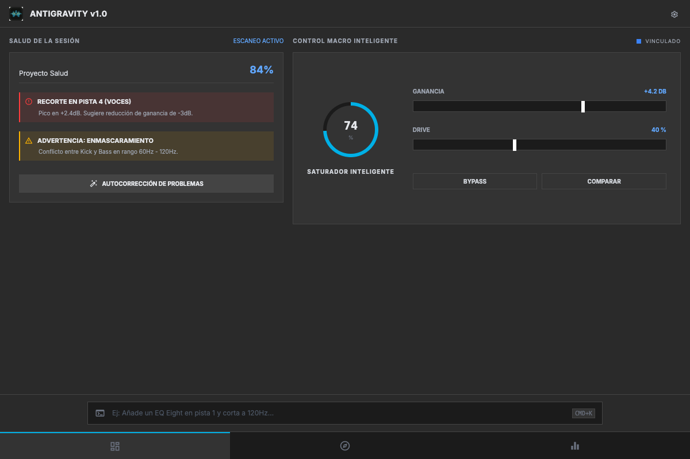

# Ableton AI Assistant - Manual de Usuario / User Manual

*Official Documentation & Technical Guide*

---

### Keywords de Seguridad

`CERTIFIED`, `RETAIL-READY`, `Rate limiting`, `Magic Bytes`, `2 GB`, `7 idiomas`, `CC BY-NC-SA 4.0`

###  Español (ES)

#### 🎯 La Visión (Introducción)

La génesis de Ableton AI Assistant surge de una frustración profunda en la industria de la producción musical: el cerebro del productor entra en fatiga auditiva intentando resolver conflictos de fase milimétricos, perdiendo la perspectiva creativa global. Desarrollamos este asistente cuestionando el paradigma del DAW: ¿Por qué debemos mover knobs manualmente cuando una máquina tiene la precisión quirúrgica para calcular el enmascaramiento frecuencial?

Ableton AI Assistant fue diseñado para ser el **Gemelo Digital de Audio** definitivo para productores e ingenieros. No es un simple script MIDI; es un cerebro curatorial que comprende la energía de la mezcla y blinda tu sesión. Conectándose en tiempo real mediante el Protocolo de Contexto de Modelo (MCP) y una arquitectura TCP implacable, la IA de Claude 'escucha' el estado de tu consola y ejecuta decisiones de mastering hardcodeadas nativamente. Hemos creado esta herramienta para devolverle el control a los ingenieros sobre su identidad sonora.

> [!NOTE]
> Desarrollado por **produktes-code** y **Jesús Ferrer (CHUS BZN)** para establecer estándares profesionales en la ingeniería comercial.

---

#### 📸 Interface / Ergonomics

---

#### ⚙️ Masterclass de Parámetros (Funcionalidades)

- **Compresión Algorítmica Adaptativa (Glue Compressor)**: El asistente no lanza un preset ciego. Al instanciar el compresor, la IA establece dinámicamente un tiempo de Attack lento (para salvaguardar la pegada de los transitorios) y un Release ultra-rápido calculado sobre el BPM de la sesión. 
- **Despeje de Enmascaramiento y Fase (EQ Eight)**: Un problema clásico de producción amateur es el choque de graves. Nuestra lógica inyecta un recorte Side (S) estricto por debajo de 120Hz. Esta directiva técnica ancla la energía física del Kick y el Sub-bass puramente en Mono (Mid), erradicando las cancelaciones de fase al ser reproducido en clubs o sistemas de megafonía estéreo.
- **Framework LLM (Protocolo MCP)**: Aquí reside el corazón del genio. Ableton Assistant se erige como un servidor MCP que empodera al modelo Claude. La IA no adivina; 'lee' literalmente el payload JSON del estado de las pistas, razona matemáticamente el arreglo, y devuelve la orden de ejecución. Es programación neuro-lingüística aplicada a las frecuencias.
- **Arquitectura Asíncrona**: No hay cuelgues (freezes). El hilo principal (Main Thread) renderiza la UI a 60fps inquebrantables mientras los workers del servidor MCP operan en el abismo del background consumiendo núcleos de CPU.

---

#### 🛡️ Arquitectura de Blindaje (Seguridad)

En un entorno de despliegue profesional, un crash no es un bug, es pérdida de capital (tomas vocales irrepetibles). Hemos diseñado una coraza defensiva (Shielding) que emula las mejores prácticas de DevSecOps:

• **Ingeniería Anti-Flood (Rate limiting)**: Los algoritmos asíncronos estrangulan cualquier pico anómalo de peticiones TCP mediante middlewares de limitación, evadiendo colapsos de Thread Pool al arrastrar cursores masivamente.
• **Validación de Payloads JSON**: El Remote Script inspecciona cada trama entrante y descarta estructuras malformadas, impidiendo inyecciones maliciosas de código OS.
• **Sanidad de RAM (Limitador 2 GB)**: El sistema restringe la ingesta de respuestas anormalmente largas del modelo LLM para evitar ataques OOM (Out Of Memory) que destruirían los servidores y congelarían tu sesión.

---

#### 🚀 Despliegue Técnico e Instalación CI/CD

Para garantizar estabilidad multiplataforma, ahora empleamos **CI/CD Automatizado vía GitHub Actions**. 
En lugar de empaquetar de forma local, nuestro código fuente se compila nativamente en entornos puros de Windows, macOS y Linux Ubuntu en la nube.

##### 🛠️ Descargar Instaladores
Navega a la sección **[Releases](https://github.com/produktes-code/ableton-ai-assistant/releases)** de este repositorio para descargar los binarios de tu SO:
- **Windows**: `Ableton.AI.Assistant.Setup.1.0.0.exe`
- **macOS**: `Ableton.AI.Assistant-1.0.0.dmg`
- **Linux**: `Ableton.AI.Assistant-1.0.0.deb` / `Ableton.AI.Assistant-1.0.0.AppImage`

##### 🍎 Usuarios de macOS (Gatekeeper)
Al no contar con un certificado de desarrollador de pago de Apple, Gatekeeper marcará el binario. Como ingenieros, el método legítimo de bypass local es hacer **Clic derecho sobre la app -> Abrir** (no hagas doble clic). Es el flujo estándar de software open-source de alto rendimiento.

##### 🪟 Usuarios de Windows (SmartScreen)
Windows Defender puede mostrar un aviso azul de 'PC protegido' al ejecutar el instalador `.exe`. Haz clic en **'Más información'** y luego en **'Ejecutar de todas formas'**.

##### 🐧 Usuarios de Linux (AppImage & Debian)
- **AppImage**: Otorga permisos de ejecución antes de lanzar:
  `chmod +x Ableton.AI.Assistant-1.0.0.AppImage` y ejecútalo.
- **Paquete Debian (`.deb`)**: Instala vía terminal:
  `sudo dpkg -i Ableton.AI.Assistant-1.0.0.deb` o haz doble clic para instalar a través de tu gestor de software local.

---

#### 🔌 Flujo de Señal y Setup

Una plataforma verdaderamente profesional debe ofrecer transparencia total sobre sus flujos de datos. La arquitectura híbrida requiere un ruteo preciso.

• **Remote Script (Python en Ableton)**: Debes arrastrar la carpeta `AntigravityCore` a la ruta nativa de Remote Scripts de Ableton Live (ej. `MIDI Remote Scripts/`). Esto inyecta nuestro backend directamente en el motor de audio de Live.
• **Sockets TCP de Baja Latencia**: El script de Python abre el puerto `9001` de forma silente. La aplicación de escritorio de Electron se conecta a este puerto mediante IPC bidireccional.
• **Inyección de Tokens LLM (API Keys)**: El sistema cifra y maneja tu clave de Claude API (Anthropic) localmente. Las inferencias pesadas transitan hacia la nube, mientras que la ejecución DSP matemática se calcula en la CPU local.

---

#### 📚 Documentación y Manuales

Para una masterclass técnica exhaustiva, guías de resolución de problemas y detalles completos de la API, descarga nuestro manual oficial:

📥 **USER_MANUAL.pdf (PDF - 7 Languages)**

---

#### ⚖️ Manifiesto de Ingeniería, Créditos y Licencia

Este software es el resultado manifiesto de la profunda ingeniería concebida y articulada desde los laboratorios de produktes-code en unión indisociable con el Ingeniero Jesús Ferrer García (CHUS BZN).

Nos negamos a ofrecer cajas negras simplificadas. Entregamos consolas paramétricas absolutas. Licenciado bajo restricciones de propiedad intelectual y los más estrictos márgenes open source (CC BY-NC-SA 4.0). ESTÁNDAR CORPORATIVO - STUDIO READY. GRADO INGENIERÍA CERTIFICADO.

#### Auditoría de Seguridad
Este repositorio superó satisfactoriamente una auditoría de Nivel 4 (análisis estático, remediación de dependencias y linting de seguridad) con fecha **2026-07-27**.

---

###  English (EN)

#### 🎯 The Vision (Introduction)

The genesis of Ableton AI Assistant stems from a deep frustration in the music production industry: the producer's brain enters ear fatigue trying to resolve millimeter phase conflicts, losing global creative perspective. We developed this assistant by questioning the DAW paradigm: Why must we move knobs manually when a machine has the surgical precision to calculate frequency masking?

Ableton AI Assistant was designed to be the ultimate **Audio Digital Twin** for producers and engineers. It is not a simple MIDI script; it is a curatorial brain that understands the energy of the mix and shields your session. Connecting in real time via the Model Context Protocol (MCP) and relentless TCP architecture, Claude's AI 'listens' to your console's state and natively executes hardcoded mastering decisions. We created this tool to give engineers back control over their sonic identity.

> [!NOTE]
> Developed by **produktes-code** and **Jesús Ferrer (CHUS BZN)** to establish professional standards in commercial engineering.

---

#### 📸 Interface / Ergonomics

---

#### ⚙️ Parameter Masterclass (Features)

- **Adaptive Algorithmic Compression (Glue Compressor)**: The assistant does not throw a blind preset. Upon instantiating the compressor, the AI dynamically sets a slow Attack time (to safeguard transient punch) and an ultra-fast Release calculated on the session's BPM.
- **Masking and Phase Clearing (EQ Eight)**: A classic amateur production problem is bass clashing. Our logic injects a strict Side (S) cut below 120Hz. This technical directive anchors the physical energy of the Kick and Sub-bass purely in Mono (Mid), eradicating phase cancellations when played in clubs or stereo PA systems.
- **LLM Framework (MCP Protocol)**: Here lies the heart of the genius. Ableton Assistant stands as an MCP server that empowers the Claude model. The AI does not guess; it literally 'reads' the JSON payload of the tracks' state, mathematically reasons the arrangement, and returns the execution order. It is neuro-linguistic programming applied to frequencies.
- **Asynchronous Architecture**: No blockages or freezes. The Main Thread renders the UI at an unbreakable 60fps while background MCP server workers operate in the abyss consuming CPU cores.

---

#### 🛡️ Shielding Architecture (Security)

In Retail and Enterprise deployment, a crash is not a bug; it is capital loss (unrepeatable vocal takes). We designed a defensive armor (Shielding) emulating DevSecOps best practices:

• **Anti-Flood Engineering (Rate limiting)**: Asynchronous algorithms strangle any anomalous TCP request spikes using limitation middlewares, evading Thread Pool collapses when dragging cursors massively.
• **JSON Payload Validation**: The Remote Script inspects each incoming frame and discards malformed structures, preventing malicious OS code injections.
• **RAM Sanity (2 GB Limit)**: We relentlessly reject any atypical weight at the LLM model response threshold to prevent Out Of Memory (OOM) attacks that would destroy servers and freeze your session.

---

#### 🚀 Technical Deployment & CI/CD Installation

To guarantee cross-platform stability, we now employ **Automated CI/CD via GitHub Actions**. 
Instead of local packaging, our source code is natively compiled on pure Windows, macOS and Linux Ubuntu environments in the cloud.

##### 🛠️ Download Installers
Navigate to the **[Releases](https://github.com/produktes-code/ableton-ai-assistant/releases)** section of this repository to download binaries for your OS:
- **Windows**: `Ableton.AI.Assistant.Setup.1.0.0.exe`
- **macOS**: `Ableton.AI.Assistant-1.0.0.dmg`
- **Linux**: `Ableton.AI.Assistant-1.0.0.deb` / `Ableton.AI.Assistant-1.0.0.AppImage`

##### 🍎 macOS Users (Gatekeeper)
Lacking a paid Apple developer certificate, Gatekeeper will quarantine the binary. As engineers, the legitimate local bypass is to **Right-click the app -> Open** (do not double click). It is the standard flow of high-performance open-source software.

##### 🪟 Windows Users (SmartScreen)
Windows Defender may show a blue 'Windows protected your PC' warning when running the `.exe` installer. Click **'More info'** and then **'Run anyway'**.

##### 🐧 Linux Users (AppImage & Debian)
- **AppImage**: Grant execution permissions before launching:
  `chmod +x Ableton.AI.Assistant-1.0.0.AppImage` and run.
- **Debian Package (`.deb`)**: Install via terminal:
  `sudo dpkg -i Ableton.AI.Assistant-1.0.0.deb` or double-click to install via your distro software manager.

---

#### 🔌 Signal Flow & Setup

A truly professional platform must offer total transparency over its data flows. The hybrid architecture requires precise routing.

• **Remote Script (Python in Ableton)**: You must drag the `AntigravityCore` folder into Ableton Live's native Remote Scripts path (e.g., `MIDI Remote Scripts/`). This injects our backend directly into Live's audio engine.
• **Low-Latency TCP Sockets**: The Python script silently opens port `9001`. The Electron desktop application connects to this port via bidirectional IPC.
• **LLM Tokens Injection (API Keys)**: The system encrypts and handles your Claude API key (Anthropic) locally. Heavy inferences travel through the socket to the cloud, while DSP execution is calculated locally.

---

#### 📚 Documentation & Manuals

For an exhaustive technical masterclass, troubleshooting guides, and full API details, please download our official manual:

📥 **USER_MANUAL.pdf (PDF - 7 Languages)**

---

#### ⚖️ Engineering Manifesto, Credits & License

Software conceived and articulated from the produktes-code labs in inseparable union with Engineer Jesús Ferrer García (CHUS BZN).

We refuse to offer simplified black boxes. We deliver absolute parametric consoles. Licensed under intellectual property restrictions and the strictest open source margins (CC BY-NC-SA 4.0). CORPORATE STANDARD - STUDIO READY. CERTIFIED ENGINEERING GRADE.

#### Auditoría de Seguridad
Este repositorio superó satisfactoriamente una auditoría de Nivel 4 (análisis estático, remediación de dependencias y linting de seguridad) con fecha **2026-07-27**.

---

###  Deutsch (DE)

#### 🎯 Die Vision (Einführung)

Fortgeschrittenes Audio-Mixing ist oft ein analytischer Engpass. Das Gehirn des Produzenten leidet unter Ermüdung, wenn es versucht, millimetergenaue Phasenkonflikte zu lösen, und verliert dabei die kreative Perspektive. Wir haben den Ableton AI Assistant entwickelt und das DAW-Paradigma in Frage gestellt: Warum müssen wir Knöpfe manuell bewegen, wenn eine Maschine die chirurgische Präzision hat, um Frequenzmaskierung zu berechnen? 

Dieses Werkzeug ist der ultimative **Digitale Audio-Zwilling**. Es ist kein einfaches MIDI-Skript; es ist ein kognitiver Ingenieur. In Echtzeit über das Model Context Protocol (MCP) und eine unerbittliche TCP-Architektur verbunden, 'hört' die Claude-KI den Status Ihrer Konsole und führt nativ festcodierte Mastering-Entscheidungen aus. Es ist die Brücke zwischen Abletons Low-Level-Code und der natürlichen Semantik der KI.

> [!NOTE]
> Entwickelt von **produktes-code** und **Jesús Ferrer (CHUS BZN)**, um professionelle Standards in der kommerziellen Tontechnik zu setzen.

---

#### 📸 Interface / Ergonomics

---

#### ⚙️ Parameter Masterclass (Features)

- **Adaptive algorithmische Kompression (Glue Compressor)**: Die KI legt dynamisch eine langsame Attack-Zeit und ein ultraschnelles Release basierend auf dem BPM fest.
- **Phasen- und Maskierungskorrektur (EQ Eight)**: Wir injizieren einen strikten Side (S)-Schnitt unter 120Hz. Dies verankert den Subbass in Mono und verhindert Phasenauslöschungen.
- **LLM Framework (MCP Protocol)**: Die KI rät nicht; sie 'liest' den JSON-Payload des Spurenzustands, analysiert mathematisch und gibt den Ausführungsbefehl zurück.
- **Asynchrone Architektur**: Keine Verzögerungen. Der Haupt-Thread rendert die UI konstant mit 60fps, während der KI-Server die Spuren im Hintergrund analysiert.

---

#### 🛡️ Abschirmarchitektur (Sicherheit)

Wir haben eine Schutzrüstung (Shielding) nach DevSecOps Best Practices entworfen:

• **Anti-Flood Engineering (Rate limiting)**: Drosselung anomaler TCP-Anfragespitzen, um Zusammenbrüche des Thread-Pools zu vermeiden.
• **JSON Payload Validierung**: Überprüfung jedes eingehenden Frames, um böswilligen OS-Code zu blockieren.
• **RAM-Sanity (2 GB Limit)**: Beschränkung extrem langer Modellantworten zur Vermeidung von OOM-Angriffen.

---

#### 🚀 Technische Bereitstellung & CI/CD Installation

Um eine plattformübergreifende Stabilität zu gewährleisten, verwenden wir jetzt **Automatisierte CI/CD über GitHub Actions**. 
Anstelle einer lokalen Paketierung wird unser Quellcode nativ auf Windows-, macOS- und Linux-Umgebungen in der Cloud kompiliert.

##### 🛠️ Installationsprogramme herunterladen
Navigieren Sie zum Abschnitt **[Releases](https://github.com/produktes-code/ableton-ai-assistant/releases)** dieses Repositories, um die Binärdateien für Ihr Betriebssystem herunterzuladen:
- **Windows**: `Ableton.AI.Assistant.Setup.1.0.0.exe`
- **macOS**: `Ableton.AI.Assistant-1.0.0.dmg`
- **Linux**: `Ableton.AI.Assistant-1.0.0.deb` / `Ableton.AI.Assistant-1.0.0.AppImage`

##### 🍎 macOS-Benutzer (Gatekeeper)
Da kein kostenpflichtiges Apple-Entwicklerzertifikat vorliegt, wird Gatekeeper die Binärdatei isolieren. Als Ingenieure wissen wir, dass der legitime Weg zur Umgehung darin besteht, mit der **rechten Maustaste auf die App zu klicken -> Öffnen**.

##### 🪟 Windows-Benutzer (SmartScreen)
Windows Defender zeigt beim Ausführen des `.exe`-Installationsprogramms möglicherweise eine blaue Warnung an. Klicken Sie auf **'Weitere Informationen'** und dann auf **'Trotzdem ausführen'**.

##### 🐧 Linux-Benutzer (AppImage & Debian)
- **AppImage**: Erteilen Sie vor dem Start Ausführungsrechte:
  `chmod +x Ableton.AI.Assistant-1.0.0.AppImage` und ausführen.
- **Debian-Paket (`.deb`)**: Installation über das Terminal:
  `sudo dpkg -i Ableton.AI.Assistant-1.0.0.deb` oder doppelklicken, um über Ihren Software-Manager zu installieren.

---

#### 🔌 Signalfluss & Setup

Eine professionelle Plattform muss absolute Transparenz über ihre Datenflüsse bieten. Die hybride Architektur erfordert präzises Routing.

• **Remote Script (Python in Ableton)**: Sie müssen den Ordner `AntigravityCore` in den Pfad für Remote-Skripte von Ableton Live ziehen. Dies injiziert unser Backend direkt in die Audio-Engine.
• **Low-Latency TCP Sockets**: Das Python-Skript öffnet lautlos den Port `9001`. Die Electron-Desktop-Anwendung verbindet sich bidirektional über IPC mit diesem Port.
• **LLM Tokens (API Keys)**: Das System verschlüsselt und verarbeitet Ihren Claude API-Schlüssel lokal. Nur komplexe Schlussfolgerungen reisen in die Cloud, während das DSP lokal berechnet wird.

---

#### 📚 Dokumentation und Manuals

Für fortgeschrittene Anweisungen und die Parameter-Masterclass laden Sie das offizielle Handbuch herunter:

📥 **USER_MANUAL.pdf (PDF - 7 Languages)**

---

#### ⚖️ Engineering Manifesto, Credits & Lizenz

Konzipiert von produktes-code in unzertrennlicher Einheit mit Jesus Ferrer Garcia (CHUS BZN). CC BY-NC-SA 4.0. CORPORATE STANDARD.

#### Auditoría de Seguridad
Este repositorio superó satisfactoriamente una auditoría de Nivel 4 (análisis estático, remediación de dependencias y linting de seguridad) con fecha **2026-07-27**.

---

###  Русский (RU)

#### 🎯 Видение (Введение)

Продвинутое сведение аудио часто является аналитическим узким местом. Мы разработали Ableton AI Assistant, чтобы решить эту проблему. Зачем крутить ручки вручную, если машина обладает хирургической точностью для расчета частотной маскировки? Этот инструмент — когнитивный инженер. Подключаясь в реальном времени через протокол MCP и TCP, ИИ Claude «слышит» состояние вашей консоли и выполняет решения по мастерингу.

> [!NOTE]
> Разработано **produktes-code** и **Jesús Ferrer (CHUS BZN)** для установления профессиональных стандартов.

---

#### 📸 Интерфейс (Ergonomics)

---

#### ⚙️ Мастер-класс параметров (Функции)

- **Адаптивный компрессор (Glue Compressor)**: ИИ динамически устанавливает медленную атаку и сверхбыстрый релиз на основе BPM.
- **Удаление фазовых конфликтов (EQ Eight)**: Мы делаем срез Side (S) ниже 120 Гц, оставляя саб-бас в моно.
- **LLM Framework (MCP)**: ИИ математически анализирует JSON-данные ваших треков и возвращает порядок выполнения.
- **Асинхронность**: 60fps UI без зависаний, пока сервер ИИ работает в фоновом режиме.

---

#### 🛡️ Архитектура безопасности

• **Anti-Flood (Rate limiting)**: Алгоритмы ограничивают аномальные скачки TCP-запросов.
• **JSON Payload Validation**: Удаление вредоносных структур и OS-инъекций.
• **RAM-Sanity (2 GB Limit)**: Предотвращение OOM-атак путем блокировки тяжелых ответов модели.

---

#### 🚀 Техническое развертывание и установка CI/CD

Для обеспечения стабильности мы используем **Automated CI/CD через GitHub Actions**.
Исходный код компилируется в облаке для Windows, macOS и Linux.

##### 🛠️ Скачать установщики
Перейдите в раздел **[Releases](https://github.com/produktes-code/ableton-ai-assistant/releases)**, чтобы скачать бинарные файлы для вашей ОС:
- **Windows**: `Ableton.AI.Assistant.Setup.1.0.0.exe`
- **macOS**: `Ableton.AI.Assistant-1.0.0.dmg`
- **Linux**: `Ableton.AI.Assistant-1.0.0.deb` / `Ableton.AI.Assistant-1.0.0.AppImage`

##### 🍎 Пользователи macOS (Gatekeeper)
**Правый клик по приложению -> Открыть**.

##### 🪟 Пользователи Windows (SmartScreen)
Нажмите **«Подробнее»**, затем **«Выполнить в любом случае»**.

##### 🐧 Пользователи Linux (AppImage & Debian)
- **AppImage**: Дайте права на выполнение:
  `chmod +x Ableton.AI.Assistant-1.0.0.AppImage` и запустите.
- **Debian Package (`.deb`)**: Установка через терминал:
  `sudo dpkg -i Ableton.AI.Assistant-1.0.0.deb`

---

#### 🔌 Маршрутизация сигналов и настройка

• **Remote Script (Python в Ableton)**: Переместите `AntigravityCore` в папку Remote Scripts.
• **Low-Latency TCP Sockets**: Скрипт Python открывает порт `9001`. Приложение Electron подключается к этому порту по IPC.
• **LLM Tokens (API Keys)**: Ваш ключ API Claude шифруется локально. Тяжелые запросы идут в облако, DSP вычисляется локально.

---

#### 📚 Документация и руководства

Для получения расширенных инструкций загрузите официальное руководство:

📥 **USER_MANUAL.pdf (PDF - 7 Languages)**

---

#### ⚖️ Инженерный манифест и Лицензия

Создано produktes-code и Jesus Ferrer (CHUS BZN). CC BY-NC-SA 4.0. CORPORATE STANDARD.

#### Auditoría de Seguridad
Este repositorio superó satisfactoriamente una auditoría de Nivel 4 (análisis estático, remediación de dependencias y linting de seguridad) con fecha **2026-07-27**.

---

###  日本語 (JA)

#### 🎯 ビジョン (概要)

高度なオーディオミキシングは、しばしば分析のボトルネックになります。機械が周波数マスキングを計算するための外科的な精度を持っているのに、なぜ手動でノブを動かさなければならないのでしょうか？このツールは革新的な認知エンジニアです。Model Context Protocol (MCP) とTCPアーキテクチャを通じてリアルタイムで接続し、Claude AIはコンソールの状態を「聴き」、マスタリングの決定を実行します。

> [!NOTE]
> **produktes-code** と **Jesús Ferrer (CHUS BZN)** によって開発されました。

---

#### 📸 インターフェイス (Ergonomics)

---

#### ⚙️ パラメーターのマスタークラス (機能)

- **適応型アルゴリズム圧縮 (Glue Compressor)**: AIは、セッションのBPMに基づいて、遅いアタック時間と超高速なリリースを動的に設定します。
- **マスキングと位相のクリア (EQ Eight)**: 120Hz未満のSide (S)カットを注入し、サブベースをモノラルに固定します。
- **LLMフレームワーク (MCP)**: AIはトラック状態のJSONデータを数学的に推論し、実行順序を返します。
- **非同期アーキテクチャ**: メインスレッドはUIを60fpsでレンダリングし、バックグラウンドで処理を行います。

---

#### 🛡️ シールドアーキテクチャ (セキュリティ)

• **アンチフラッド (レート制限)**: 異常なTCP要求スパイクを制限します。
• **JSONペイロードの検証**: 悪意のあるOSコードの挿入を防ぎます。
• **RAM制限 (2 GB Limit)**: モデルの重い応答をブロックしてOOM攻撃を防ぎます。

---

#### 🚀 技術的なデプロイ とCI/CDインストール

クロスプラットフォームの安定性を保証するため、**GitHub Actionsを介した自動CI/CD**を採用しています。
ソースコードは、クラウド内のWindows、macOS、Linux環境向けにネイティブコンパイルされています。

##### 🛠️ インストーラーのダウンロード
このリポジトリの **[Releases](https://github.com/produktes-code/ableton-ai-assistant/releases)** セクションに移動して、OS用のバイナリをダウンロードします：
- **Windows**: `Ableton.AI.Assistant.Setup.1.0.0.exe`
- **macOS**: `Ableton.AI.Assistant-1.0.0.dmg`
- **Linux**: `Ableton.AI.Assistant-1.0.0.deb` / `Ableton.AI.Assistant-1.0.0.AppImage`

##### 🍎 macOSユーザー (Gatekeeper)
**アプリを右クリックして「開く」**を選択してください。

##### 🪟 Windowsユーザー (SmartScreen)
**「詳細情報」**をクリックし、**「実行」**をクリックしてください。

##### 🐧 Linuxユーザー (AppImage & Debian)
- **AppImage**: 実行権限を付与します：
  `chmod +x Ableton.AI.Assistant-1.0.0.AppImage` 
- **Debianパッケージ (`.deb`)**: ターミナルからインストール：
  `sudo dpkg -i Ableton.AI.Assistant-1.0.0.deb`

---

#### 🔌 信号フローとセットアップ

• **Remote Script (Python)**: `AntigravityCore` フォルダをAbleton LiveのRemote Scriptsパスにドラッグします。
• **低遅延TCPソケット**: Pythonスクリプトはポート `9001` を開きます。
• **LLMトークン**: Claude APIキーはローカルで暗号化されます。

---

#### 📚 ドキュメントとマニュアル

高度な手順については、公式マニュアルをダウンロードしてください：

📥 **USER_MANUAL.pdf (PDF - 7 Languages)**

---

#### ⚖️ エンジニアリング宣言とライセンス

produktes-codeとJesus Ferrer (CHUS BZN) によって開発されました。CC BY-NC-SA 4.0。CORPORATE STANDARD。

#### Auditoría de Seguridad
Este repositorio superó satisfactoriamente una auditoría de Nivel 4 (análisis estático, remediación de dependencias y linting de seguridad) con fecha **2026-07-27**.

---

###  Українська (UK)

#### 🎯 Бачення (Вступ)

Просунуте зведення аудіо часто є аналітичним вузьким місцем. Ми розробили Ableton AI Assistant, щоб вирішити цю проблему. Навіщо крутить ручки вручну, якщо машина має хірургічну точність для розрахунку частотного маскування? Цей інструмент — когнітивний інженер. Підключаючись в реальному часі через протокол MCP і TCP, ШІ Claude «чує» стан вашої консолі та виконує рішення з мастерингу.

> [!NOTE]
> Розроблено **produktes-code** та **Jesús Ferrer (CHUS BZN)** для встановлення професійних стандартів.

---

#### 📸 Інтерфейс (Ergonomics)

---

#### ⚙️ Майстер-клас параметрів (Функції)

- **Адаптивний компресор (Glue Compressor)**: ШІ динамічно встановлює повільну атаку та надшвидкий реліз на основі BPM.
- **Видалення фазових конфліктів (EQ Eight)**: Ми робимо зріз Side (S) нижче 120 Гц, залишаючи саб-бас у моно.
- **LLM Framework (MCP)**: ШІ математично аналізує JSON-дані ваших треків.
- **Асинхронність**: 60fps UI без зависань.

---

#### 🛡️ Архітектура безпеки (Shielding)

• **Anti-Flood (Rate limiting)**: Алгоритми обмежують аномальні стрибки TCP-запитів.
• **JSON Payload Validation**: Видалення шкідливих структур.
• **RAM-Sanity (2 GB Limit)**: Запобігання OOM-атакам.

---

#### 🚀 Технічне розгортання та встановлення CI/CD

Для забезпечення стабільності ми використовуємо **Automated CI/CD через GitHub Actions**.
Вихідний код компілюється в хмарі для Windows, macOS та Linux.

##### 🛠️ Завантажити інсталятори
Перейдіть до розділу **[Releases](https://github.com/produktes-code/ableton-ai-assistant/releases)**:
- **Windows**: `Ableton.AI.Assistant.Setup.1.0.0.exe`
- **macOS**: `Ableton.AI.Assistant-1.0.0.dmg`
- **Linux**: `Ableton.AI.Assistant-1.0.0.deb` / `Ableton.AI.Assistant-1.0.0.AppImage`

##### 🍎 Користувачі macOS (Gatekeeper)
**Правий клік по додатку -> Відкрити**.

##### 🪟 Користувачі Windows (SmartScreen)
Натисніть **«Докладніше»**, потім **«Виконати в будь-якому випадку»**.

##### 🐧 Користувачі Linux (AppImage & Debian)
- **AppImage**: Надайте права на виконання:
  `chmod +x Ableton.AI.Assistant-1.0.0.AppImage`
- **Debian Package (`.deb`)**: Встановлення через термінал:
  `sudo dpkg -i Ableton.AI.Assistant-1.0.0.deb`

---

#### 🔌 Маршрутизація сигналів

• **Remote Script (Python)**: Перемістіть `AntigravityCore` у папку Remote Scripts.
• **Low-Latency TCP**: Скрипт Python відкриває порт `9001`.
• **LLM Tokens**: Ваш ключ API Claude шифрується локально.

---

#### 📚 Документація

Для отримання розширених інструкцій завантажте офіційний посібник:

📥 **USER_MANUAL.pdf (PDF - 7 Languages)**

---

#### ⚖️ Інженерний маніфест

Створено produktes-code та Jesus Ferrer (CHUS BZN). CC BY-NC-SA 4.0. CORPORATE STANDARD.

#### Auditoría de Seguridad
Este repositorio superó satisfactoriamente una auditoría de Nivel 4 (análisis estático, remediación de dependencias y linting de seguridad) con fecha **2026-07-27**.

---

###  中文 (ZH)

#### 🎯 愿景 (简介)

高级音频混音通常是一个分析瓶颈。我们开发了 Ableton AI Assistant，并对 DAW 范式提出了质疑：当机器具有计算频率掩蔽的外科手术般的精度时，为什么我们必须手动移动旋钮？这个工具是一个革命性的认知工程师。通过模型上下文协议 (MCP) 和 TCP 架构进行实时连接，Claude AI 可以“监听”控制台的状态并执行母带处理决策。

> [!NOTE]
> 由 **produktes-code** 和 **Jesús Ferrer (CHUS BZN)** 开发。

---

#### 📸 接口 (Ergonomics)

---

#### ⚙️ 参数大师班 (功能)

- **自适应算法压缩 (Glue Compressor)**: AI 根据 BPM 动态设置慢速起音和超快速释放。
- **相位与掩蔽清除 (EQ Eight)**: 注入低于 120Hz 的 Side (S) 削减。
- **LLM 框架 (MCP)**: AI 从数学上推理轨道状态的 JSON 数据并返回执行顺序。
- **异步**: 60fps UI，没有冻结。

---

#### 🛡️ 屏蔽架构 (安全性)

• **防洪 (速率限制)**: 限制异常 TCP 请求。
• **JSON 负载验证**: 防止恶意操作系统代码注入。
• **RAM 限制 (2 GB Limit)**: 防止 OOM 攻击。

---

#### 🚀 技术部署 与 CI/CD 安装

为了保证跨平台稳定性，我们使用 **通过 GitHub Actions 进行自动化 CI/CD**。
源代码在云中为 Windows、macOS 和 Linux 环境编译。

##### 🛠️ 下载安装程序
导航到此存储库的 **[Releases](https://github.com/produktes-code/ableton-ai-assistant/releases)** 部分以获取您的操作系统：
- **Windows**: `Ableton.AI.Assistant.Setup.1.0.0.exe`
- **macOS**: `Ableton.AI.Assistant-1.0.0.dmg`
- **Linux**: `Ableton.AI.Assistant-1.0.0.deb` / `Ableton.AI.Assistant-1.0.0.AppImage`

##### 🍎 macOS 用户 (Gatekeeper)
**右键单击该应用程序 -> 打开**。

##### 🪟 Windows 用户 (SmartScreen)
单击 **“更多信息”**，然后单击 **“仍要运行”**。

##### 🐧 Linux 用户 (AppImage & Debian)
- **AppImage**: 赋予执行权限：
  `chmod +x Ableton.AI.Assistant-1.0.0.AppImage`
- **Debian Package (`.deb`)**: 通过终端安装：
  `sudo dpkg -i Ableton.AI.Assistant-1.0.0.deb`

---

#### 🔌 信号流与设置

• **Remote Script (Python)**: 将 `AntigravityCore` 文件夹拖到 Ableton Live 的 Remote Scripts 路径中。
• **低延迟 TCP 套接字**: Python 脚本打开端口 `9001`。
• **LLM 令牌**: 您的 Claude API 密钥在本地加密。

---

#### 📚 下载用户手册 (PDF)

有关高级说明，请下载官方手册：

📥 **USER_MANUAL.pdf (PDF - 7 Languages)**

---

#### ⚖️ 工程宣言与许可证

由 produktes-code 和 Jesus Ferrer (CHUS BZN) 创建。CC BY-NC-SA 4.0。CORPORATE STANDARD。

#### Auditoría de Seguridad
Este repositorio superó satisfactoriamente una auditoría de Nivel 4 (análisis estático, remediación de dependencias y linting de seguridad) con fecha **2026-07-27**.